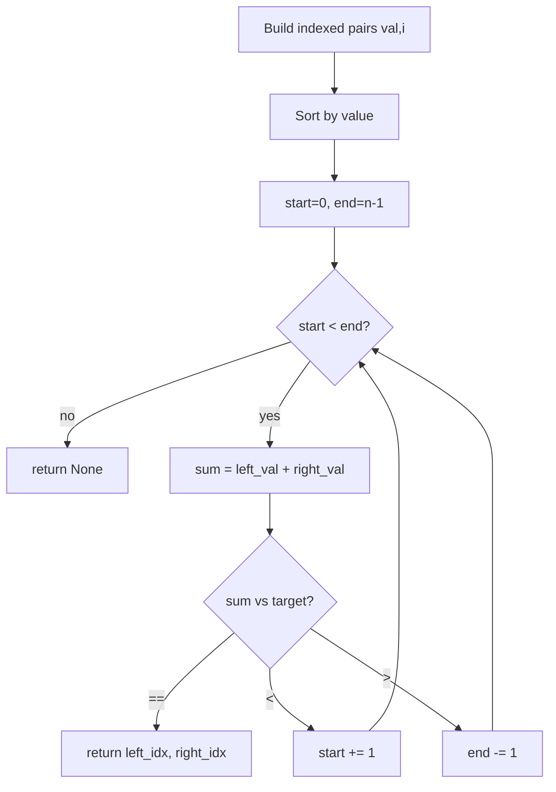
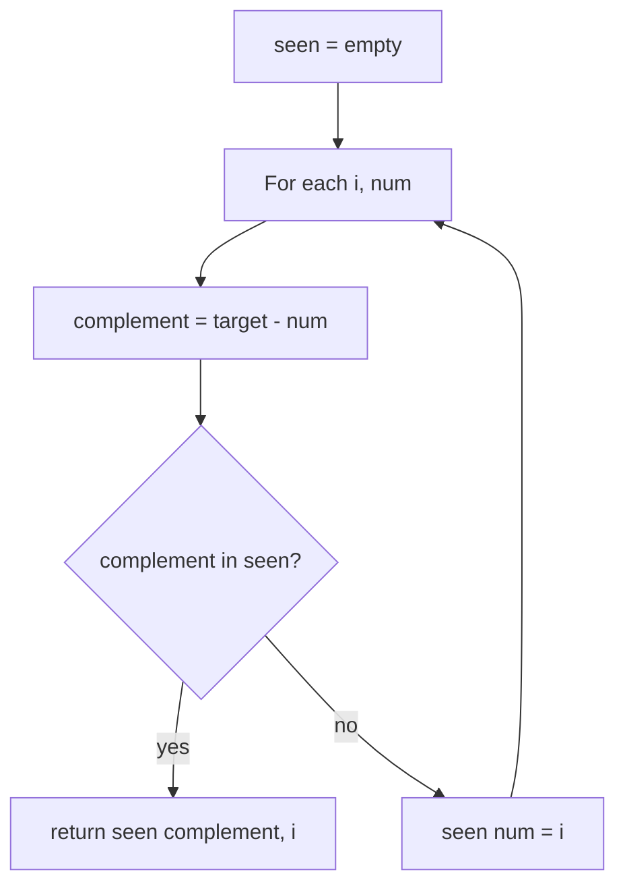
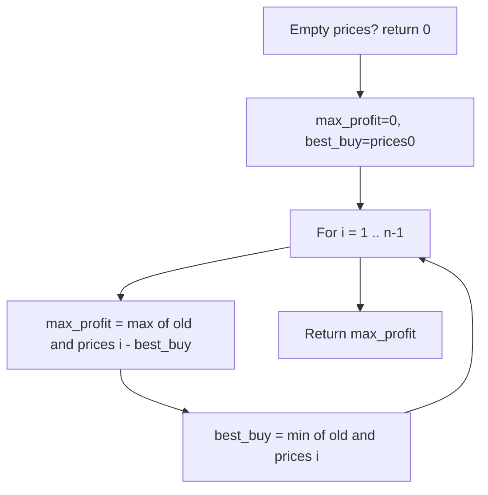
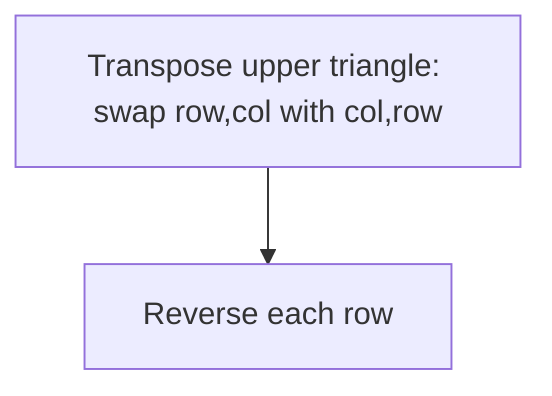
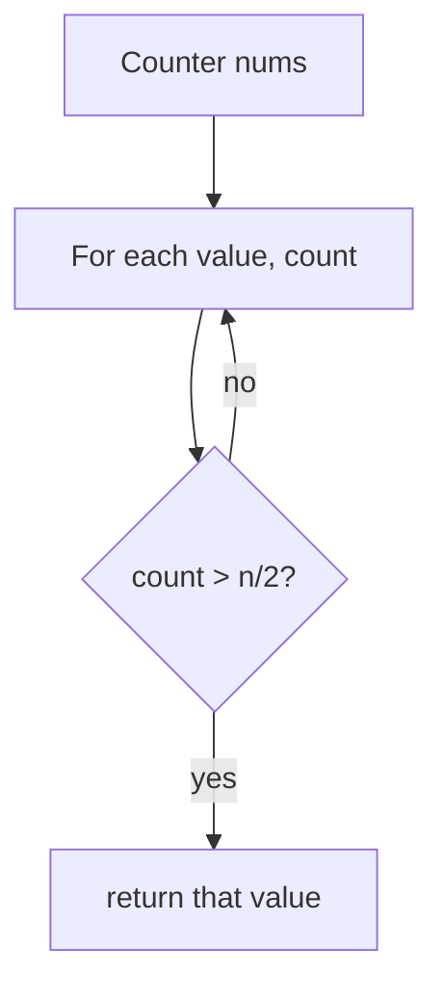
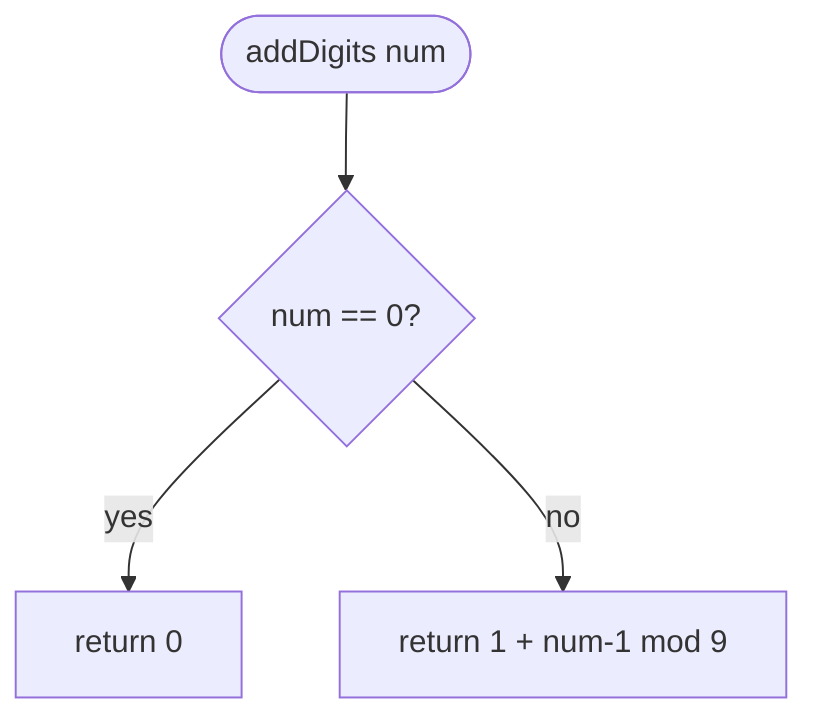
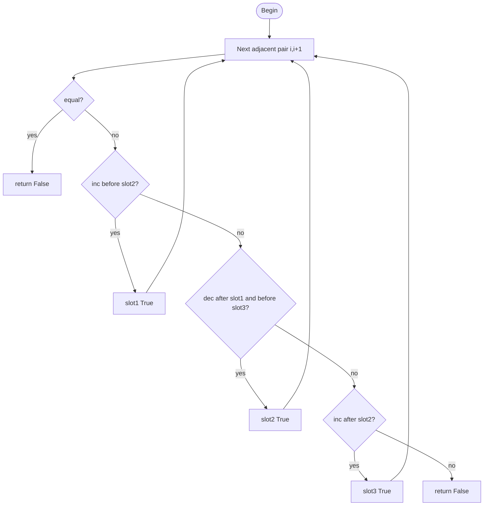
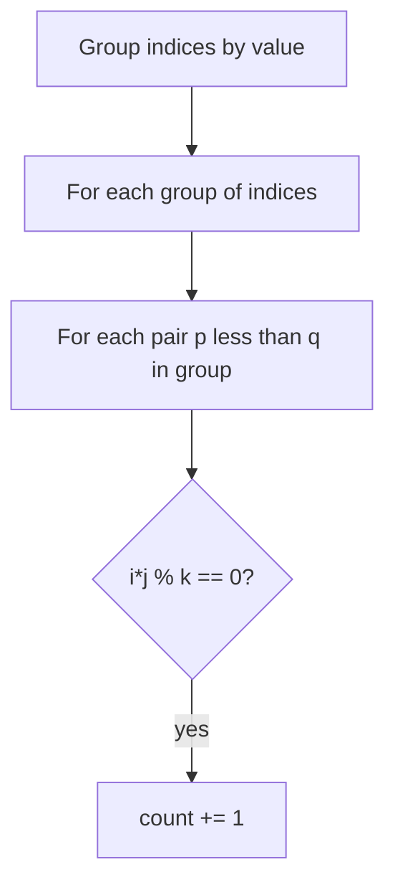
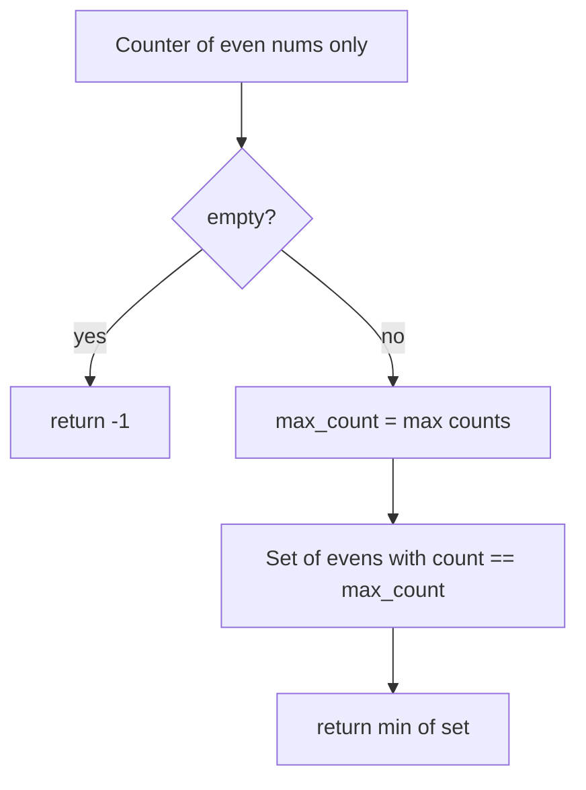
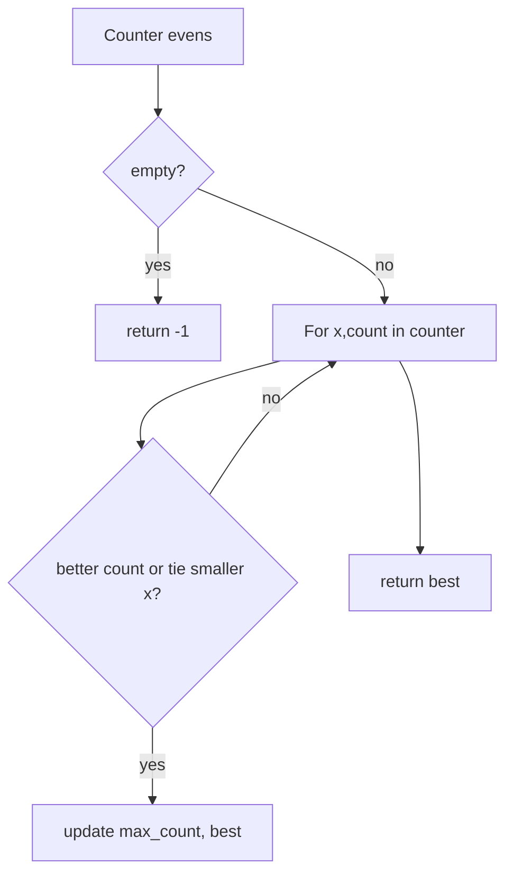

# Arrays — revision flowcharts

Each section shows **code from the repo first**, then **Mermaid** (and ASCII where helpful). Mermaid renders on GitHub and in previews with a Mermaid extension.

**Contents:** [Two Sum](#1-leetcode_1_two_sumpy) · [Best Time Stock](#2-leetcode121_best_time_to_buy_and_sell_stockpy) · [Rotate Image](#3-leetcode_48_rotate_imagepy) · [Majority Element](#4-leetcode_169_majority_elementpy) · [Add Digits](#5-leetcode_258_add_digitspy) · [Trionic Array](#6-leetcode_3637_trionic_arraypy) · [Equal Divisible Pairs](#7-leetcode_2176_count_equal_and_divisible_pairs_in_an_arraypy) · [Most Frequent Even](#8-leetcode_2404_most_frequent_even_elementpy)

---

## 1. `leetcode_1_two_sum.py`

### Code — Approach 1: sort `(value, index)` + two pointers

```python
class Solution(object):
    def twoSum(self, nums, target):
        indexed = [(val, i) for i, val in enumerate(nums)]
        indexed.sort(key=lambda x: x[0])

        start = 0
        end = len(indexed) - 1

        while start < end:
            left_val, left_idx = indexed[start]
            right_val, right_idx = indexed[end]
            total = left_val + right_val

            if total == target:
                return [left_idx, right_idx]
            elif total < target:
                start += 1
            else:
                end -= 1

        return None
```

### Flowchart — Approach 1



### Code — Approach 2: hash map (one pass)

```python
class SolutionHashMap:
    def twoSum(self, nums, target):
        seen = {}

        for i, num in enumerate(nums):
            complement = target - num
            if complement in seen:
                return [seen[complement], i]
            seen[num] = i

        return None
```

### Flowchart — Approach 2



**Facts:** Approach 1 — time O(n log n), space O(n). Approach 2 — time O(n), space O(n).

---

## 2. `leetcode121_best_time_to_buy_and_sell_stock.py`

### Code

```python
class Solution(object):
    def maxProfit(self, prices):
        if not prices:
            return 0

        max_profit = 0
        best_buy = prices[0]

        for i in range(1, len(prices)):
            max_profit = max(max_profit, prices[i] - best_buy)
            best_buy = min(best_buy, prices[i])

        return max_profit
```

### Flowchart



**ASCII**

```
Scan once: keep cheapest buy so far; each day update best profit if you sell today.
```

**Facts:** Time O(n), space O(1).

---

## 3. `leetcode_48_rotate_image.py`

### Code

```python
class Solution(object):
    def rotate(self, matrix):
        n = len(matrix)

        for row in range(n):
            for col in range(row, n):
                matrix[row][col], matrix[col][row] = matrix[col][row], matrix[row][col]

        for i in range(n):
            matrix[i].reverse()
```

### Flowchart



**ASCII**

```
90° clockwise  ==  transpose  +  reverse each row
```

**Facts:** Time O(n²), space O(1) extra.

---

## 4. `leetcode_169_majority_element.py`

### Code

```python
class Solution(object):
    def majorityElement(self, nums):
        element_frequencies = Counter(nums)
        for key, value in element_frequencies.items():
            if value > math.floor(len(nums) / 2):
                return key
        return None
```

### Flowchart



**Facts:** Time O(n), space O(u) distinct keys (≤ n).

---

## 5. `leetcode_258_add_digits.py`

### Code (current stub)

```python
class Solution(object):
    def addDigits(self, num):
        pass
```

### Planned O(1) digital root (matches docstring follow-up)

```python
class Solution(object):
    def addDigits(self, num):
        if num == 0:
            return 0
        return 1 + (num - 1) % 9
```

### Flowchart — digital root



**Facts:** O(1) time and space for the formula; loop-based simulation would be O(log num) per round.

---

## 6. `leetcode_3637_trionic_array.py`

### Code

```python
class Solution(object):
    def isTrionic(self, nums):
        slot1 = False
        slot2 = False
        slot3 = False

        for i in range(len(nums) - 1):
            if nums[i] == nums[i + 1]:
                return False
            if nums[i] < nums[i + 1] and not slot2 and not slot3:
                slot1 = True
            elif nums[i] > nums[i + 1] and slot1 and not slot3:
                slot2 = True
            elif nums[i] < nums[i + 1] and slot2:
                slot3 = True
            else:
                return False

        return slot1 and slot2 and slot3
```

### Flowchart



After the `for` loop finishes without early `return`, return `slot1 and slot2 and slot3`.

**Facts:** Time O(n), space O(1).

---

## 7. `leetcode_2176_count_equal_and_divisible_pairs_in_an_array.py`

### Code — brute force (`countPairs`)

```python
def countPairs(self, nums, k):
    counter = 0
    for i in range(len(nums)):
        for j in range(i + 1, len(nums)):
            if nums[i] == nums[j] and (i * j) % k == 0:
                counter += 1
    return counter
```

### Flowchart — brute

**ASCII** (matches the two nested `for` loops)

```
counter = 0
for i = 0 .. n-1:
    for j = i+1 .. n-1:
        if nums[i] == nums[j] and (i * j) % k == 0:
            counter += 1
return counter
```

### Code — grouped indices (`countPairsOptimized`)

```python
def countPairsOptimized(self, nums, k):
    groups = defaultdict(list)
    for i, v in enumerate(nums):
        groups[v].append(i)

    count = 0
    for indices in groups.values():
        for p in range(len(indices)):
            for q in range(p + 1, len(indices)):
                i, j = indices[p], indices[q]
                if (i * j) % k == 0:
                    count += 1
    return count
```

### Flowchart — optimized



**Facts:** Brute O(n²) time, O(1) space. Optimized O(n) to build groups + Σ g² over group sizes; worst O(n²).

---

## 8. `leetcode_2404_most_frequent_even_element.py`

### Code — `mostFrequentEven`

```python
def mostFrequentEven(self, nums):
    counter = Counter(i for i in nums if i % 2 == 0)

    if not counter:
        return -1

    max_count = max(counter.values())
    result = {x for x, count in counter.items() if count == max_count}

    return min(result)
```

### Flowchart



### Code — `mostFrequentEven_optimized` (single pass over counter)

```python
def mostFrequentEven_optimized(self, nums):
    counter = Counter(i for i in nums if i % 2 == 0)
    if not counter:
        return -1
    max_count = -1
    best = None
    for x, count in counter.items():
        if count > max_count or (count == max_count and (best is None or x < best)):
            max_count = count
            best = x
    return best
```

### Flowchart — optimized



**Facts:** Building counter is O(n); both variants O(n) time; space O(k) for k distinct evens.

---

## More topics

See [RECURSION_FLOWCHARTS.md](../recursion_backtracking/RECURSION_FLOWCHARTS.md) for recursion/backtracking. Other folders can get similar `*_FLOWCHARTS.md` files on request.
