# Binary search — revision flowcharts

Each section shows **code from the repo first**, then **Mermaid** (and ASCII where helpful). Mermaid renders on GitHub and in previews with a Mermaid extension.

**Contents:** [704 Binary Search](#1-leetcode_704_binary_searchpy) · [35 Search Insert](#2-35_search_insert_positionpy) · [First / Last Occurrence](#3-first_and_last_occurance_of_elementpy) · [Floor](#4-find_floor_of_elementpy) · [Descending Array](#5-binary_serch_reverse_sorted_arraypy) · [Rotation Count](#6-no_of_times_sorted_array_is_rotatedpy) · [153 Min Rotated](#7-leetcode_153_find_minimum_in_rotated_sorted_arraypy) · [744 Next Letter](#8-leetcode_744_find_letter_greater_than_targetpy) · [2529 Pos / Neg Count](#9-leetcode_2529_max_count_of_positive_negative_integerpy)

---

## 1. `leetcode_704_binary_search.py`

### Code

```python
class Solution(object):
    def search(self, nums, target):
        start = 0
        end = len(nums) - 1

        while start <= end:
            mid = (start + end) // 2
            if nums[mid] == target:
                return mid

            if nums[mid] > target:
                end = mid - 1
            else:
                start = mid + 1

        return -1
```

### Flowchart

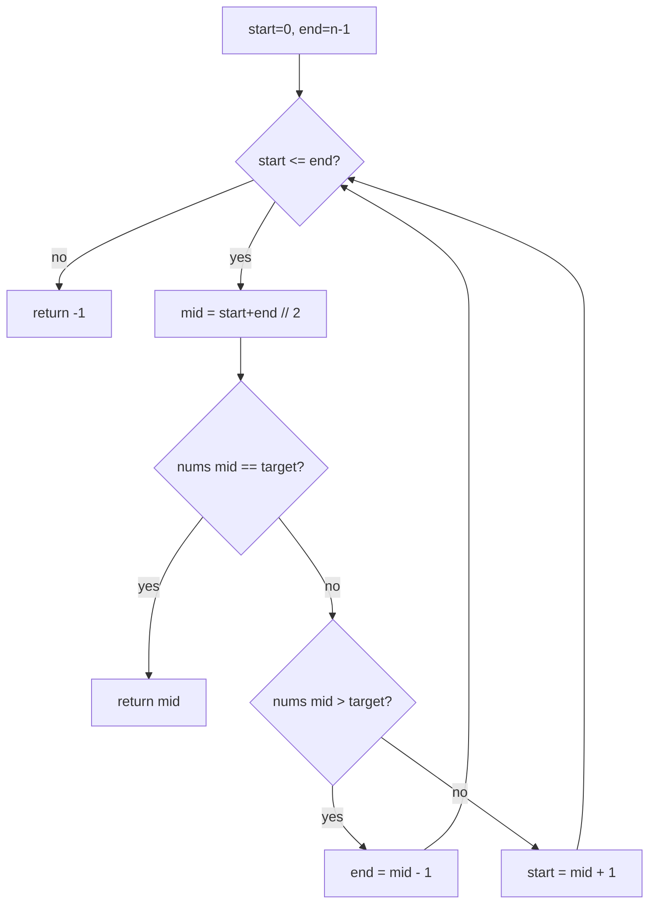

**Facts:** Time O(log n), space O(1).

---

## 2. `35_search_insert_position.py`

### Code

```python
class Solution(object):
    def searchInsert(self, nums, target):
        l = 0
        r = len(nums) - 1

        while l <= r:
            mid = l + (r - l) // 2

            if nums[mid] == target:
                return mid

            if nums[mid] > target:
                r = mid - 1
            else:
                l = mid + 1

        return l
```

### Flowchart

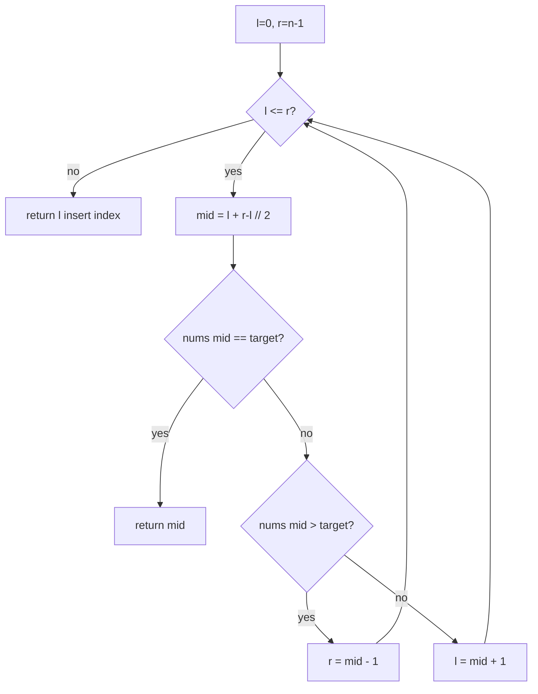

**Facts:** When the loop exits, `l` is the first index where `nums[i] >= target` (insert position). Time O(log n), space O(1).

---

## 3. `first_and_last_occurance_of_element.py`

### Code

```python
class Solution(object):
    def firstandLastOccuranceofNumber(self, nums, target):
        start = 0
        end = len(nums) - 1
        first = -1

        while start <= end:
            mid = (start + end) // 2

            if nums[mid] == target:
                first = mid
                end = mid - 1
            elif nums[mid] > target:
                end = mid - 1
            else:
                start = mid + 1

        start = 0
        end = len(nums) - 1
        last = -1

        while start <= end:
            mid = (start + end) // 2

            if nums[mid] == target:
                last = mid
                start = mid + 1
            elif nums[mid] > target:
                end = mid - 1
            else:
                start = mid + 1

        if first == -1:
            return [-1, -1]

        return [first, last]
```

### Flowchart — pass 1 (leftmost index of `target`)

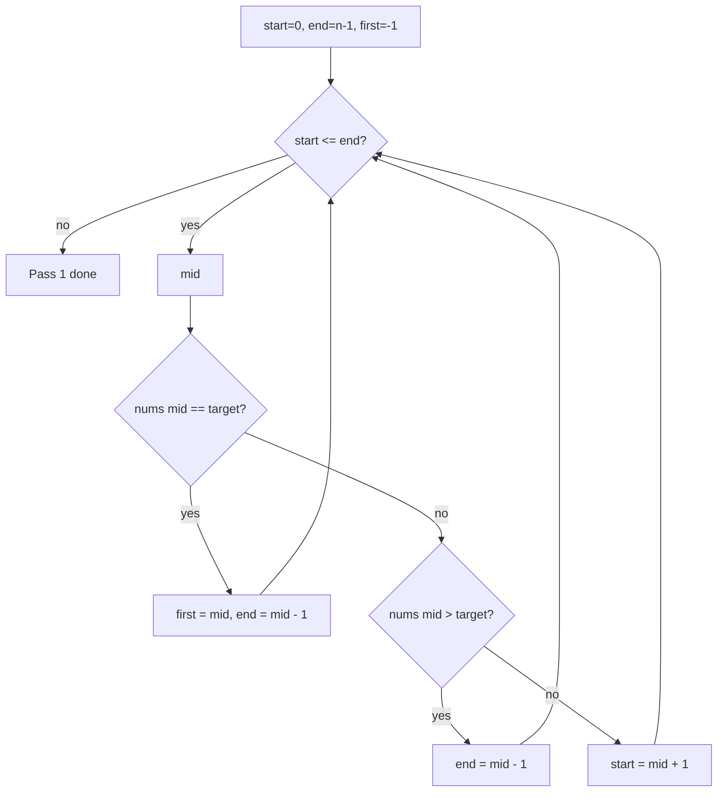

### Flowchart — pass 2 (rightmost index of `target`)

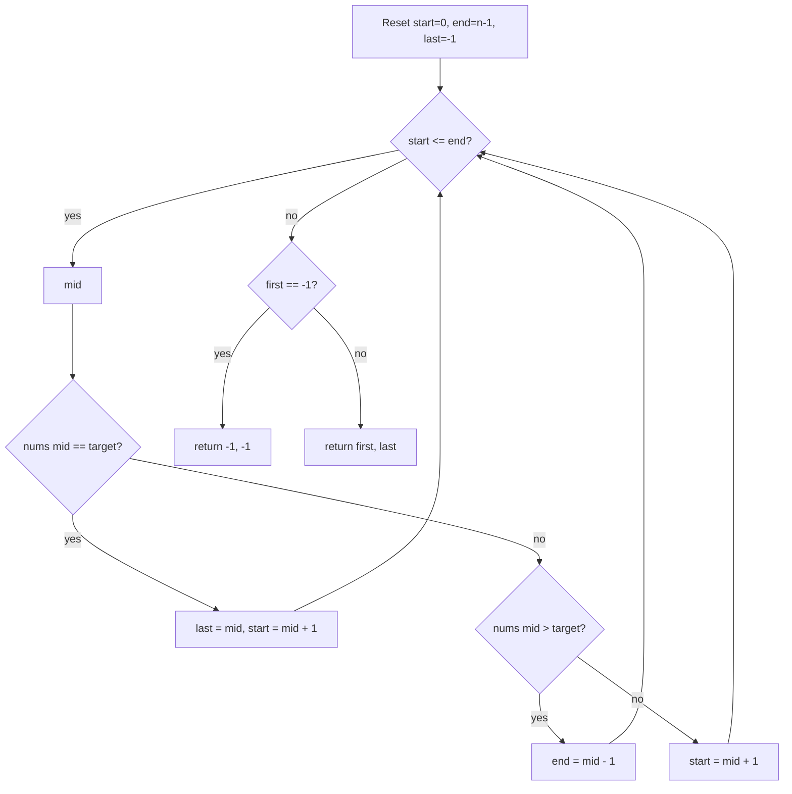

**ASCII**

```
First:  on == target → remember index, search LEFT  (end = mid - 1).
Last:   on == target → remember index, search RIGHT (start = mid + 1).
```

**Facts:** Two passes, each O(log n); space O(1).

---

## 4. `find_floor_of_element.py`

### Code

```python
class Solution(object):
    def findFloorementinArray(self, nums, target):
        start = 0
        end = len(nums) - 1
        result = -1

        while start <= end:
            mid = (start + end) // 2

            if nums[mid] == target:
                end = mid - 1
            elif nums[mid] > target:
                end = mid - 1
            else:
                result = nums[mid]
                start = mid + 1

        return result
```

### Flowchart

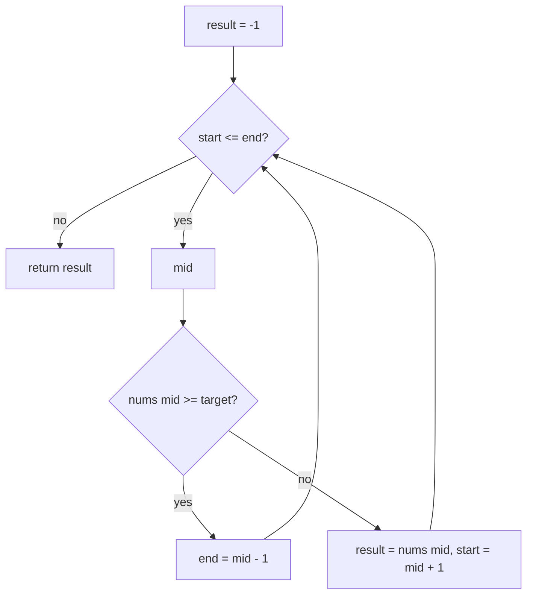

**Facts:** Largest value strictly less than `target`. Time O(log n), space O(1).

---

## 5. `binary_serch_reverse_sorted_array.py`

### Code

```python
class Solution(object):
    def searchInReverseSorted(self, nums, target):
        start = 0
        end = len(nums) - 1

        while start <= end:
            mid = (start + end) // 2

            if nums[mid] == target:
                return True

            if nums[mid] < target:
                end = mid - 1
            else:
                start = mid + 1

        return False
```

### Flowchart

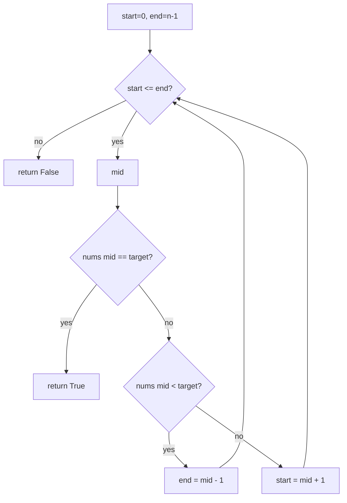

**Facts:** Descending order flips which half to take versus classic search. Time O(log n), space O(1).

---

## 6. `no_of_times_sorted_array_is_rotated.py`

### Code

```python
class Solution(object):
    def countArrayRotation(self, nums):
        left = 0
        right = len(nums) - 1

        while left < right:
            if nums[left] <= nums[right]:
                return left

            mid = left + (right - left) // 2

            if nums[mid] >= nums[left]:
                left = mid + 1
            else:
                right = mid

        return left
```

### Flowchart

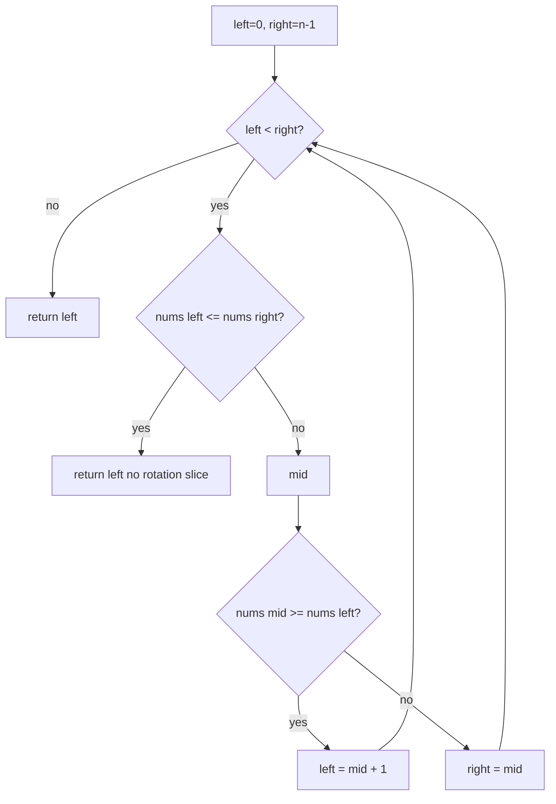

**Facts:** Index of minimum = rotation count (distinct ascending rotated). Time O(log n), space O(1).

---

## 7. `leetcode_153_find_minimum_in_rotated_sorted_array.py`

### Code

```python
class Solution(object):
    def findMin(self, nums):
        l = 0
        r = len(nums) - 1

        while l < r:
            mid = l + (r - l) // 2

            if nums[mid] > nums[r]:
                l = mid + 1
            else:
                r = mid

        return nums[l]
```

### Flowchart

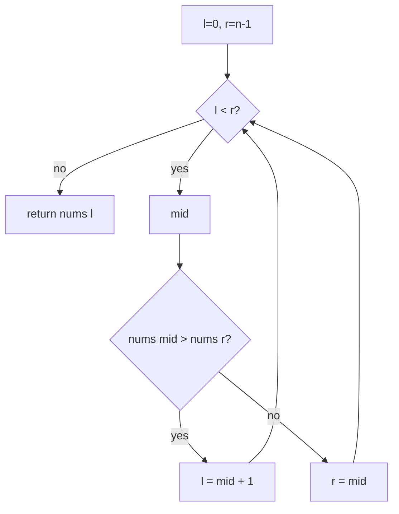

**Facts:** Compare `mid` to **right** boundary; minimum lies in unsorted half. Time O(log n), space O(1).

---

## 8. `leetcode_744_find_letter_greater_than_target.py`

### Code

```python
class Solution(object):
    def nextGreatestLetter(self, letters, target):
        start = 0
        end = len(letters) - 1
        result = None

        while start <= end:
            mid = (start + end) // 2

            if letters[mid] == target:
                start = mid + 1
            elif letters[mid] > target:
                result = letters[mid]
                end = mid - 1
            else:
                start = mid + 1

        return result if result is not None else letters[0]
```

### Flowchart

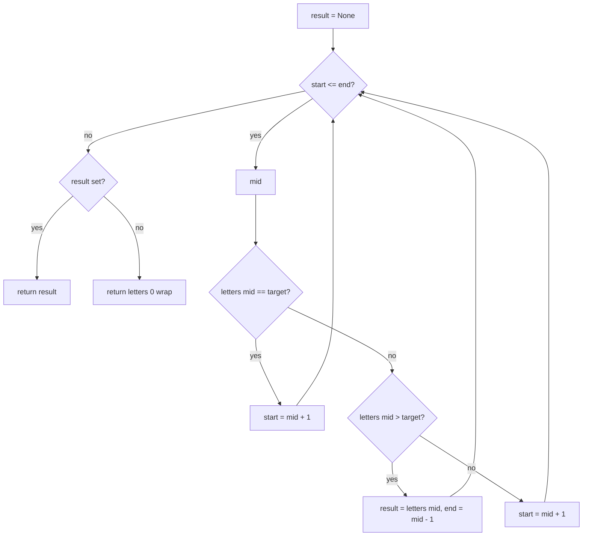

**Facts:** Smallest letter strictly greater than `target`; else first letter. Time O(log n), space O(1).

---

## 9. `leetcode_2529_max_count_of_positive_negative_integer.py`

### Code

```python
class Solution(object):
    def maximumCount(self, nums):
        left, right = 0, len(nums) - 1
        while left <= right:
            mid = (left + right) >> 1
            if nums[mid] > 0:
                right = mid - 1
            else:
                left = mid + 1

        pos = len(nums) - left

        left = 0
        while left <= right:
            mid = (left + right) >> 1
            if nums[mid] == 0:
                right = mid - 1
            else:
                left = mid + 1

        neg = left

        return pos if pos > neg else neg
```

### Flowchart — pass 1 (`pos`)

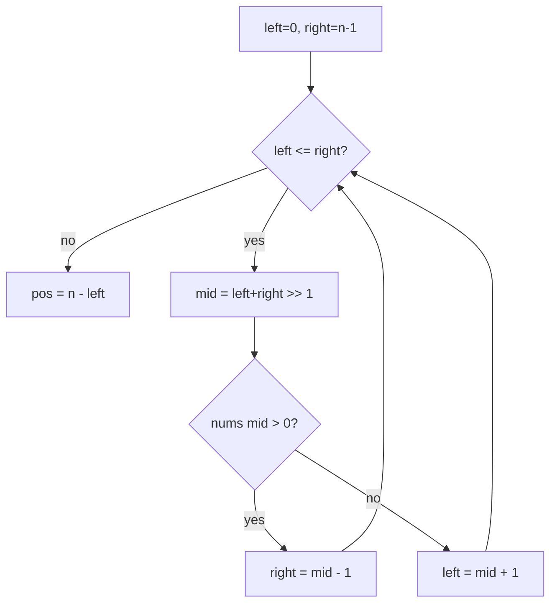

### Flowchart — pass 2 (`neg`, same `right` variable as when pass 1 ended)

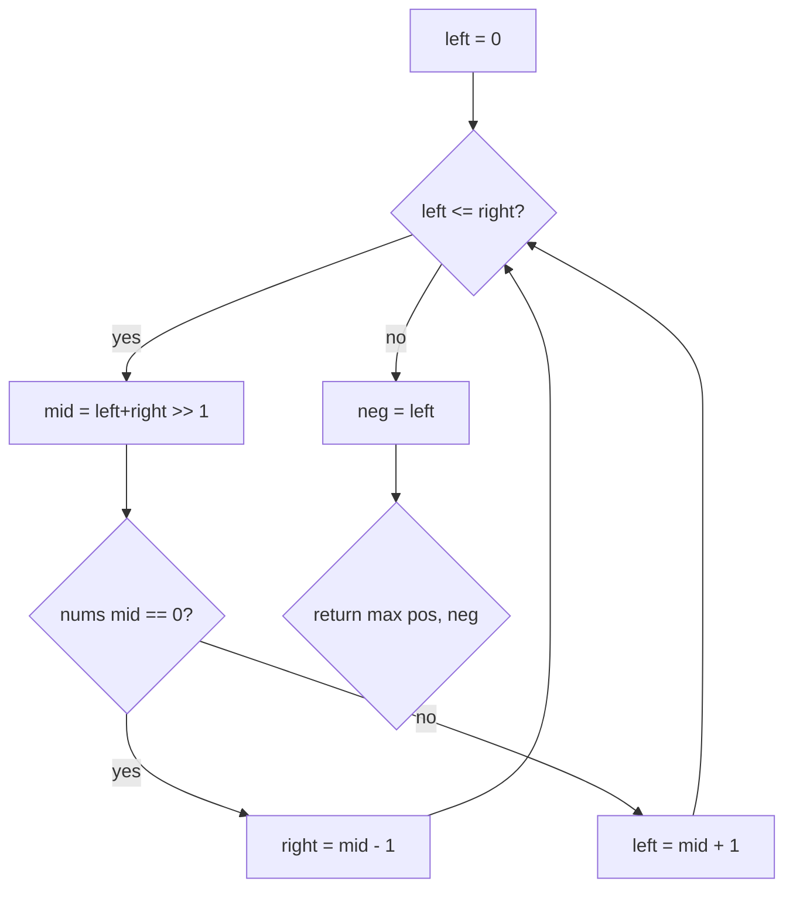

**ASCII**

```
pos = number of strictly positive values = len(nums) - (first index i with nums[i] > 0).

neg = number of strictly negative values: second loop uses the file’s left/right state (right not reset to n-1).
```

**Facts:** Two binary searches; time O(log n), space O(1).

---

## More topics

- [ARRAYS_FLOWCHARTS.md](../arrays/ARRAYS_FLOWCHARTS.md)
- [RECURSION_FLOWCHARTS.md](../recursion_backtracking/RECURSION_FLOWCHARTS.md)
