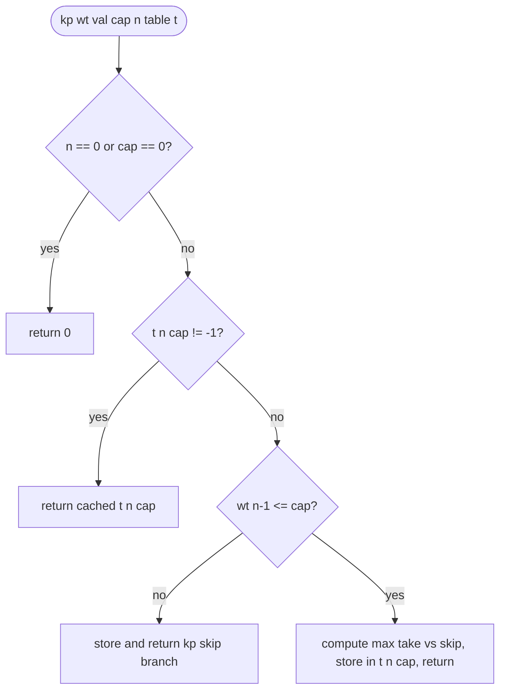
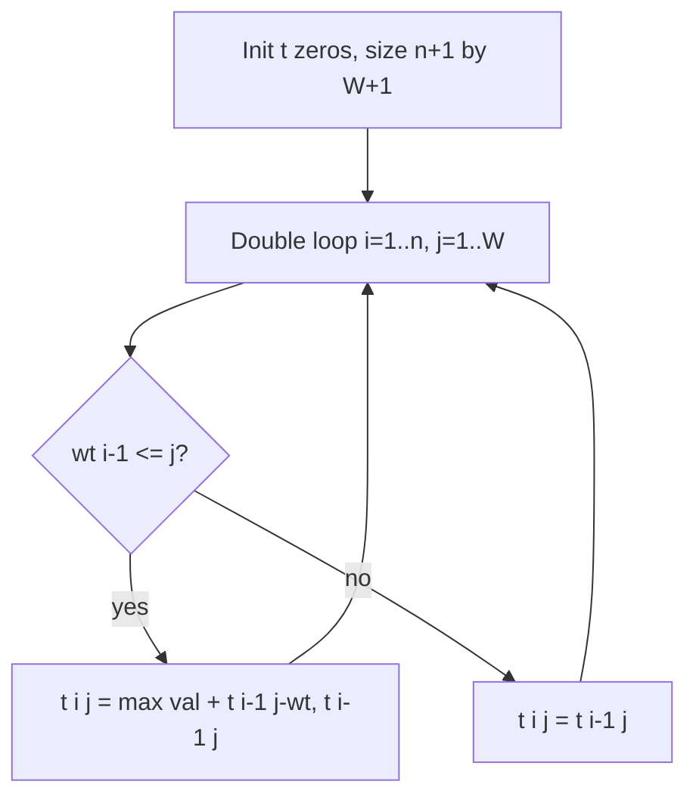
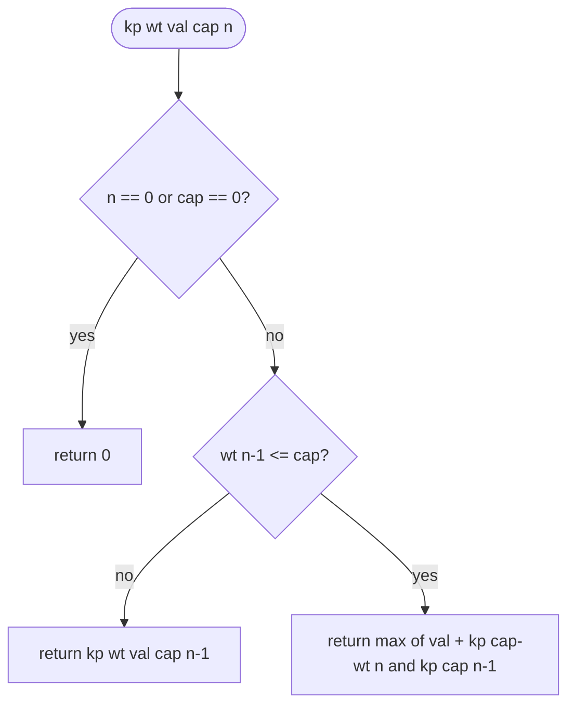
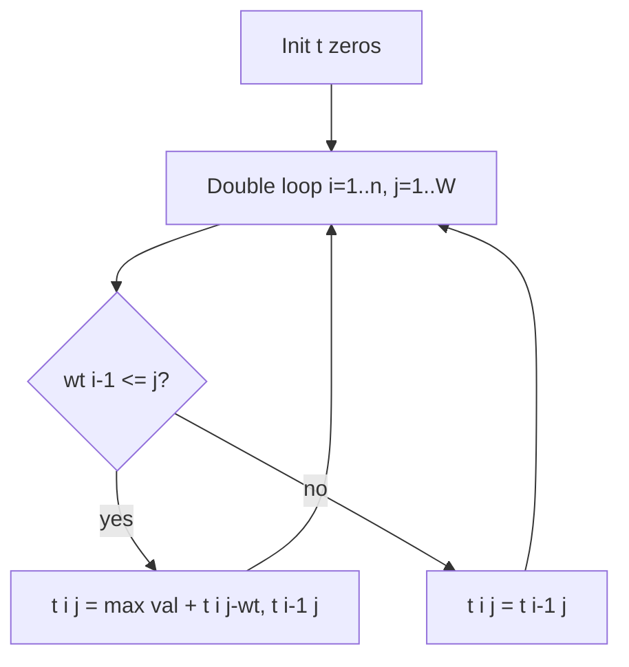
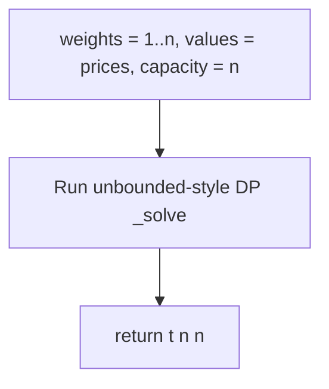
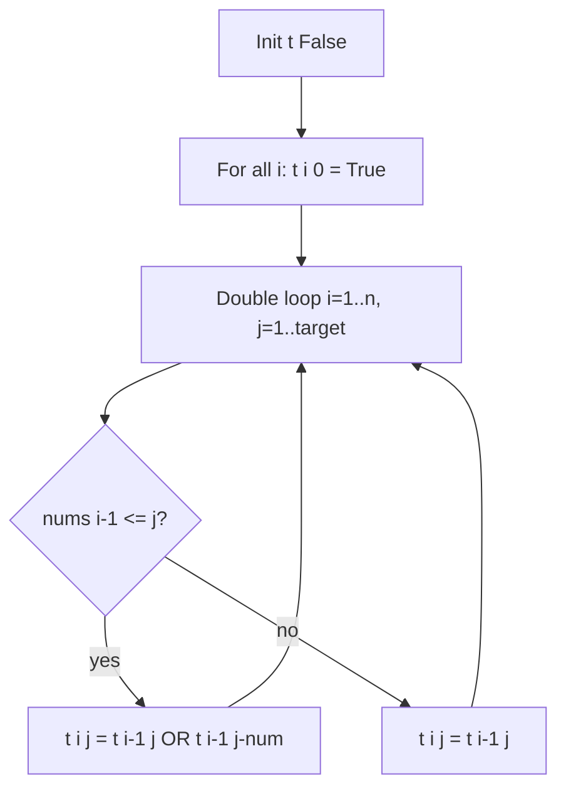
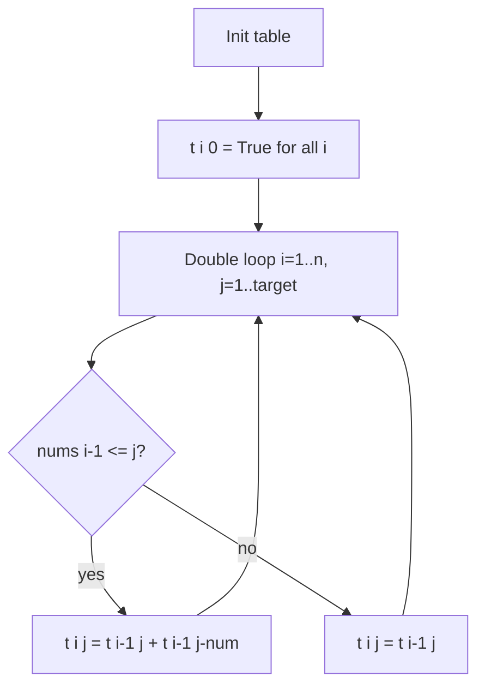
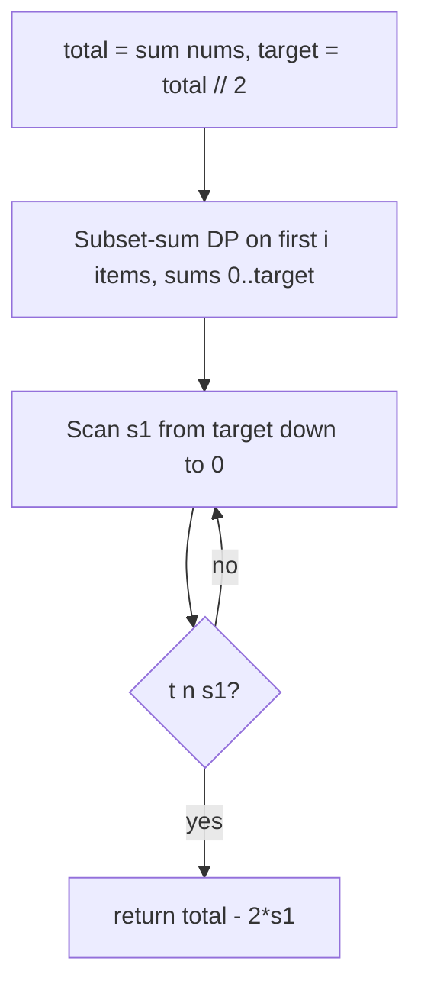
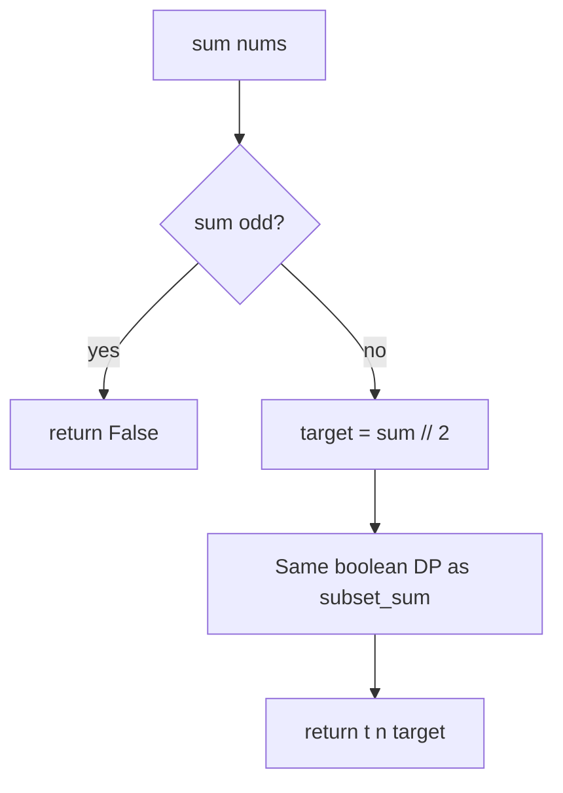

# Dynamic programming — revision flowcharts

Each section shows **code from the repo first**, then **Mermaid** (and ASCII where helpful). Mermaid renders on GitHub and in previews with a Mermaid extension.

**Contents:** [0/1 Knapsack recursive](#1-knapsack_01py) · [0/1 memoized](#2-knapsack_01_memoizedpy) · [0/1 tabulation](#3-knapsack_01_top_downpy) · [Unbounded recursive](#4-unbounded_knapsackpy) · [Unbounded tabulation](#5-unbounded_knapsack_top_downpy) · [Rod cutting](#6-rod_cuttingpy) · [Subset sum](#7-subset_sumpy) · [Count subset sums](#8-count_of_subset_sumpy) · [Min subset diff](#9-minimum_subset_sum_differencepy) · [LeetCode 416](#10-leetcode_416_partition_equal_subset_sumpy)

---

## 1. `knapsack_01.py`

### Code

```python
def kp(wt, val, cap, n):
    if n == 0 or cap == 0:
        return 0

    if wt[n - 1] <= cap:
        return max(
            val[n - 1] + kp(wt, val, cap - wt[n - 1], n - 1),
            kp(wt, val, cap, n - 1),
        )
    else:
        return kp(wt, val, cap, n - 1)


def knapsack_01(weights, values, capacity):
    n = len(weights)
    return kp(weights, values, capacity, n)
```

### Flowchart


**ASCII**

```
State: (n items considered, capacity cap).
Take item n-1  →  value + kp(..., cap - wt[n-1], n-1).
Skip           →  kp(..., cap, n-1).
```

**Facts:** Exponential time without memo; space O(n) stack.

---

## 2. `knapsack_01_memoized.py`

### Code

```python
def kp(wt, val, cap, n, t):
    if n == 0 or cap == 0:
        return 0

    if t[n][cap] != -1:
        return t[n][cap]

    if wt[n - 1] <= cap:
        t[n][cap] = max(
            val[n - 1] + kp(wt, val, cap - wt[n - 1], n - 1, t),
            kp(wt, val, cap, n - 1, t),
        )
        return t[n][cap]
    else:
        t[n][cap] = kp(wt, val, cap, n - 1, t)
        return t[n][cap]


def knapsack_01(weights, values, capacity):
    n = len(weights)
    t = [[-1 for _ in range(capacity + 1)] for _ in range(n + 1)]
    return kp(weights, values, capacity, n, t)
```

### Flowchart



**Facts:** Time O(n·W), space O(n·W) for table plus O(n) stack.

---

## 3. `knapsack_01_top_down.py`

*(File name says “top down”; implementation is **bottom-up** tabulation.)*

### Code

```python
def _kp(wt, val, cap, n, t):
    for i in range(1, n + 1):
        for j in range(1, cap + 1):
            if wt[i - 1] <= j:
                t[i][j] = max(
                    val[i - 1] + t[i - 1][j - wt[i - 1]],
                    t[i - 1][j],
                )
            else:
                t[i][j] = t[i - 1][j]

    return t[n][cap]


def knapsack_01(weights, values, capacity):
    n = len(weights)
    t = [[0 for _ in range(capacity + 1)] for _ in range(n + 1)]
    return _kp(weights, values, capacity, n, t)
```

### Flowchart



When every `(i, j)` is filled, return **`t[n][W]`**.

**Facts:** `t[i][j]` = best value using first `i` items, capacity `j`. Include uses **`t[i-1][j-wt]`** (item used once). Time O(n·W), space O(n·W).

---

## 4. `unbounded_knapsack.py`

### Code

```python
def kp(wt, val, cap, n):
    if n == 0 or cap == 0:
        return 0

    if wt[n - 1] <= cap:
        return max(
            val[n - 1] + kp(wt, val, cap - wt[n - 1], n),
            kp(wt, val, cap, n - 1),
        )
    else:
        return kp(wt, val, cap, n - 1)


def unbounded_knapsack(weights, values, capacity):
    n = len(weights)
    return kp(weights, values, capacity, n)
```

### Flowchart



**Facts:** **Include** recurses with same `n` so the same type can be picked again. Time exponential without DP.

---

## 5. `unbounded_knapsack_top_down.py`

*(Bottom-up table; same filename pattern as §3.)*

### Code

```python
def _kp(wt, val, cap, n, t):
    for i in range(1, n + 1):
        for j in range(1, cap + 1):
            if wt[i - 1] <= j:
                t[i][j] = max(
                    val[i - 1] + t[i][j - wt[i - 1]],
                    t[i - 1][j],
                )
            else:
                t[i][j] = t[i - 1][j]

    return t[n][cap]


def unbounded_knapsack(weights, values, capacity):
    n = len(weights)
    t = [[0 for _ in range(capacity + 1)] for _ in range(n + 1)]
    return _kp(weights, values, capacity, n, t)
```

### Flowchart



When the table is full, return **`t[n][W]`**.

**Facts:** Include uses **`t[i][j - wt]`** (same row → repeat item). Exclude uses `t[i-1][j]`. Time O(n·W), space O(n·W).

---

## 6. `rod_cutting.py`

### Code

```python
def _solve(wt, val, n, cap, t):
    for i in range(1, n + 1):
        for j in range(1, cap + 1):
            if wt[i - 1] <= j:
                t[i][j] = max(
                    val[i - 1] + t[i][j - wt[i - 1]],
                    t[i - 1][j],
                )
            else:
                t[i][j] = t[i - 1][j]
    return t[n][cap]


def rod_cutting(prices, n):
    wt = list(range(1, n + 1))
    val = prices[:n]
    t = [[0 for _ in range(n + 1)] for _ in range(n + 1)]
    return _solve(wt, val, n, n, t)
```

### Flowchart



**ASCII**

```
Piece of length L has weight L and value prices[L-1]. Same recurrence as unbounded knapsack on n types, capacity n.
```

**Facts:** Time O(n²), space O(n²).

---

## 7. `subset_sum.py`

### Code

```python
def subset_sum(nums, target):
    n = len(nums)
    t = [[False for _ in range(target + 1)] for _ in range(n + 1)]

    for i in range(n + 1):
        t[i][0] = True

    for i in range(1, n + 1):
        for j in range(1, target + 1):
            if nums[i - 1] <= j:
                t[i][j] = t[i - 1][j] or t[i - 1][j - nums[i - 1]]
            else:
                t[i][j] = t[i - 1][j]

    return t[n][target]
```

### Flowchart



Then return **`t[n][target]`**.

**Facts:** `t[i][j]` = can first `i` elements sum to `j`. Time O(n·target), space O(n·target).

---

## 8. `count_of_subset_sum.py`

### Code

```python
def count_of_subset_sum(nums, target):
    n = len(nums)
    t = [[False for _ in range(target + 1)] for _ in range(n + 1)]

    for i in range(n + 1):
        t[i][0] = True

    for i in range(1, n + 1):
        for j in range(1, target + 1):
            if nums[i - 1] <= j:
                t[i][j] = t[i - 1][j] + t[i - 1][j - nums[i - 1]]
            else:
                t[i][j] = t[i - 1][j]

    return t[n][target]
```

### Flowchart



Then return **`t[n][target]`**.

**Facts:** Same loops as subset sum; transition **adds** counts (in Python, `True` behaves as `1` in arithmetic, so cells become integer counts). Time O(n·target).

---

## 9. `minimum_subset_sum_difference.py`

### Code

```python
def minimum_subset_sum_difference(nums):
    n = len(nums)
    total = sum(nums)
    target = total // 2

    t = [[False for _ in range(target + 1)] for _ in range(n + 1)]

    for i in range(n + 1):
        t[i][0] = True

    for i in range(1, n + 1):
        for j in range(1, target + 1):
            if nums[i - 1] <= j:
                t[i][j] = t[i - 1][j] or t[i - 1][j - nums[i - 1]]
            else:
                t[i][j] = t[i - 1][j]

    for s1 in range(target, -1, -1):
        if t[n][s1]:
            return total - (2 * s1)

    return 0
```

### Flowchart



**ASCII**

```
Largest achievable s1 ≤ total/2 minimizes |sum(S1) - sum(S2)| = total - 2*s1.
```

**Facts:** Time O(n·S), space O(n·S) with S = total sum (table only up to ⌊S/2⌋).

---

## 10. `leetcode_416_partition_equal_subset_sum.py`

### Code

```python
class Solution(object):
    def canPartition(self, nums):
        sum_of_nums = sum(nums)
        if sum_of_nums % 2 != 0:
            return False

        target = sum_of_nums // 2
        n = len(nums)
        t = [[False for _ in range(target + 1)] for _ in range(n + 1)]

        for i in range(n + 1):
            t[i][0] = True

        for i in range(1, n + 1):
            for j in range(1, target + 1):
                if nums[i - 1] <= j:
                    t[i][j] = t[i - 1][j] or t[i - 1][j - nums[i - 1]]
                else:
                    t[i][j] = t[i - 1][j]

        return t[n][target]
```

### Flowchart



**Facts:** Equivalent to **subset sum** with `target = sum/2` after parity check. Time O(n·target).

---

## More topics

- [ARRAYS_FLOWCHARTS.md](../arrays/ARRAYS_FLOWCHARTS.md)
- [BINARY_SEARCH_FLOWCHARTS.md](../binary_search/BINARY_SEARCH_FLOWCHARTS.md)
- [RECURSION_FLOWCHARTS.md](../recursion_backtracking/RECURSION_FLOWCHARTS.md)
