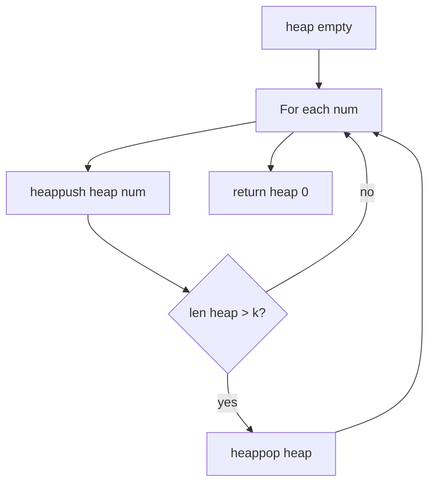
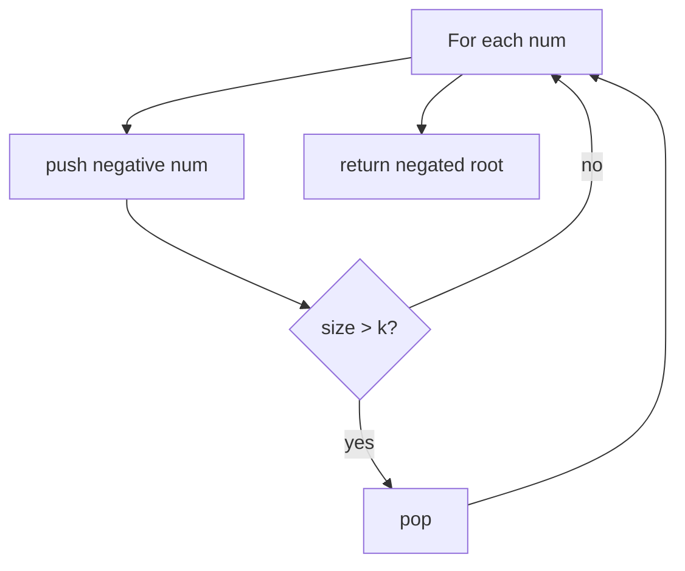
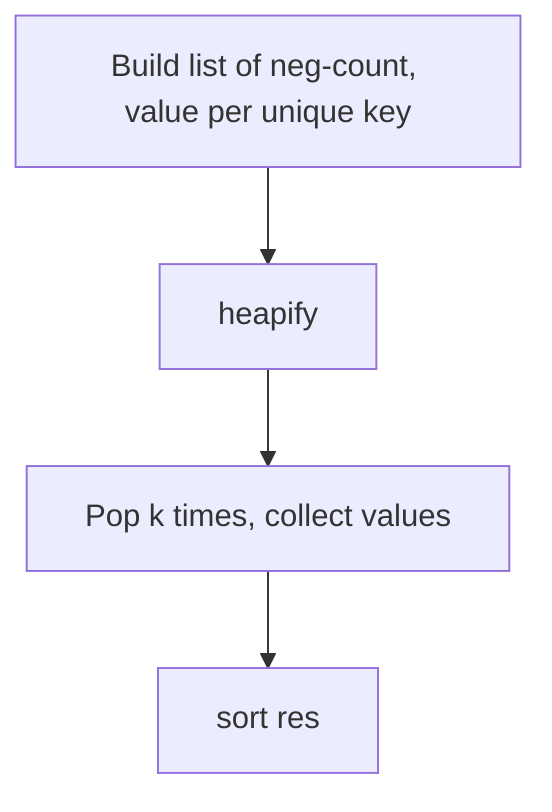
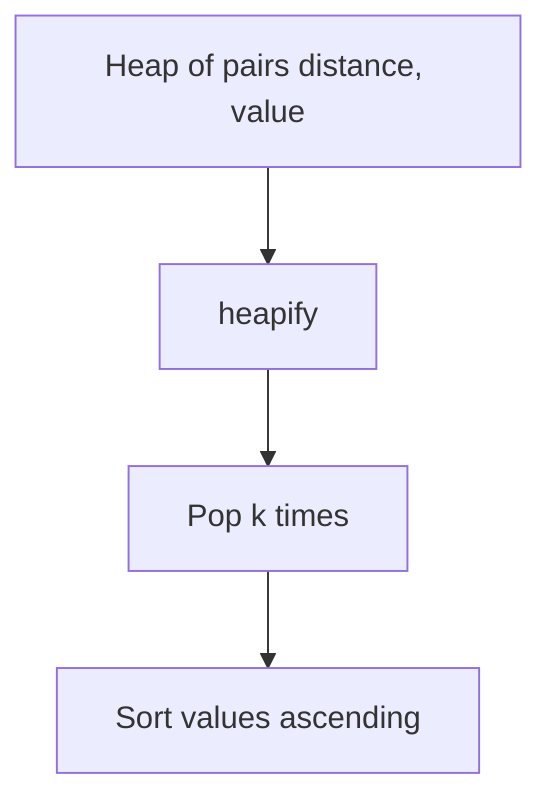
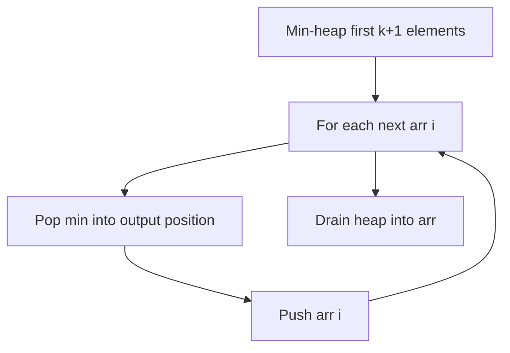
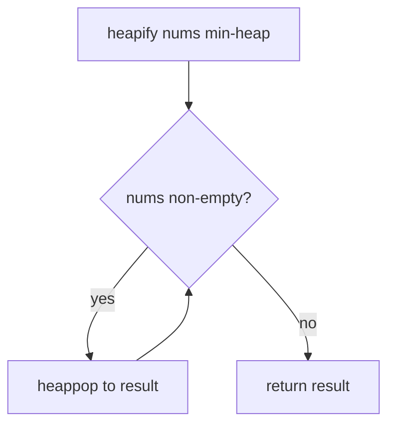
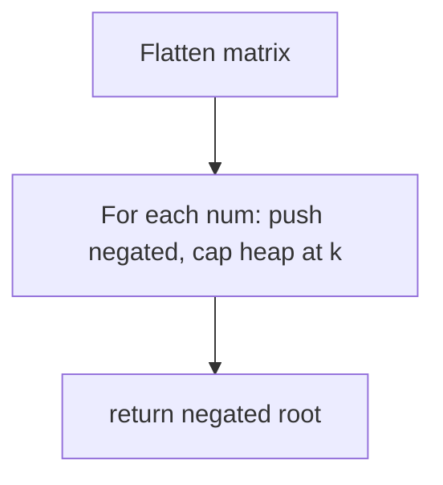

# Heap — revision flowcharts

Each section shows **code from the repo first**, then **Mermaid** (and ASCII where helpful). Mermaid renders on GitHub and in previews with a Mermaid extension.

**Contents:** [215 Kth largest](#1-leetcode_215_kth_largest_element_in_an_arraypy) · [Kth smallest](#2-kth_smallest_element_in_an_arraypy) · [347 Top K frequent](#3-leetcode_347_top_k_frequent_elementspy) · [658 K closest](#4-leetcode_658_find_k_closest_elementspy) · [Sort k-sorted](#5-sort_k_sorted_arraypy) · [912 Heap sort](#6-leetcode_912_sort_an_arraypy) · [378 Kth in matrix](#7-leetcode_378_kth_smallest_element_in_a_sorted_matrixpy)

---

## 1. `leetcode_215_kth_largest_element_in_an_array.py`

### Code — sort

```python
class Solution(object):
    def findKthLargest(self, nums, k):
        nums.sort()
        return nums[-k]
```

### Code — min-heap of size k

```python
class Solution1(object):
    def findKthLargest(self, nums, k):
        heap = []
        for num in nums:
            heapq.heappush(heap, num)
            if len(heap) > k:
                heapq.heappop(heap)
        return heap[0]
```

### Flowchart — heap approach



**Facts:** Sort O(n log n). Heap O(n log k) time, O(k) space.

---

## 2. `kth_smallest_element_in_an_array.py`

### Code — sort

```python
class Solution(object):
    def findKthSmallest(self, nums, k):
        nums = sorted(nums)
        return nums[k - 1]
```

### Code — max-heap via negation

```python
class Solution1(object):
    def findKthSmallest(self, nums, k):
        heap = []
        for num in nums:
            heapq.heappush(heap, -num)
            if len(heap) > k:
                heapq.heappop(heap)
        return -heap[0]
```

### Flowchart



**Facts:** Same asymptotics as §1; k smallest ↔ k largest of negated values.

---

## 3. `leetcode_347_top_k_frequent_elements.py`

### Code

```python
class Solution(object):
    def topKFrequent(self, nums, k):
        keys_list = list(set(nums))
        heap = [(-nums.count(i), i) for i in keys_list]
        heapq.heapify(heap)
        res = []
        for i in range(k):
            res.append(heapq.heappop(heap)[1])
        res.sort()
        return res
```

### Flowchart



**Facts:** Counting uses `nums.count` per unique key (costly); heapify + k pops. See docstring for complexity discussion.

---

## 4. `leetcode_658_find_k_closest_elements.py`

### Code

```python
class Solution:
    def findClosestElements(self, arr, k, x):
        heap = [(abs(x - i), i) for i in arr]
        heapq.heapify(heap)
        res = []
        for i in range(k):
            res.append(heapq.heappop(heap)[1])
        res.sort()
        return res
```

### Flowchart



**Facts:** Tuple order breaks ties by smaller value first. O(n + k log n) time, O(n) heap.

---

## 5. `sort_k_sorted_array.py`

### Code

```python
class Solution(object):
    def sortKSorted(self, arr, k):
        heap = arr[:k+1]
        heapq.heapify(heap)
        index = 0
        for i in range(k+1, len(arr)):
            arr[index] = heapq.heappop(heap)
            heapq.heappush(heap, arr[i])
            index += 1
        while heap:
            arr[index] = heapq.heappop(heap)
            index += 1
        return arr
```

### Flowchart



**Facts:** O(n log k) time, O(k) heap.

---

## 6. `leetcode_912_sort_an_array.py`

### Code

```python
class Solution(object):
    def sortArray(self, nums):
        heapq.heapify(nums)
        result = []
        while nums:
            result.append(heapq.heappop(nums))
        return result
```

### Flowchart



**Facts:** Heap sort via `heapq`; O(n log n) time.

---

## 7. `leetcode_378_kth_smallest_element_in_a_sorted_matrix.py`

### Code

```python
class Solution(object):
    def kthSmallest(self, matrix, k):
        arr = [item for sublist in matrix for item in sublist]
        heap = []
        for num in arr:
            heapq.heappush(heap, -num)
            if len(heap) > k:
                heapq.heappop(heap)
        return -heap[0]
```

### Flowchart



**Facts:** O(n² log k) time; flattens full matrix (extra space O(n²) for the list).

---

## More topics

[BINARY_SEARCH_FLOWCHARTS.md](../binary_search/BINARY_SEARCH_FLOWCHARTS.md) · [DYNAMIC_PROGRAMMING_FLOWCHARTS.md](../dynamic_programming/DYNAMIC_PROGRAMMING_FLOWCHARTS.md)
