# Linked list — revision flowcharts

Each section shows **code from the repo first**, then **Mermaid** where it helps. Many files share `ListNode` / `build_tree`-style helpers; focus is on the **core algorithm** in each exercise.

**Contents:** [Convert array → DLL](#1-convert_array_to_doubly_linked_listpy) · [Convert array → SLL](#2-convert_array_to_linked_listpy) · [Doubly list ops](#3-doubly_linked_list_operationspy) · [Insert / delete SLL](#4-insert_delete_linked_listpy) · [141 Cycle](#5-leetcode_141_linked_list_cyclepy) · [160 Intersection](#6-leetcode_160_intersection_of_two_linked_listspy) · [19 Remove nth end](#7-leetcode_19_remove_nth_node_from_end_of_listpy) · [2 Add two numbers](#8-leetcode_2_add_two_numberspy) · [206 Reverse](#9-leetcode_206_reverse_linked_listpy) · [21 Merge sorted](#10-leetcode_21_merge_two_sorted_listspy) · [234 Palindrome](#11-leetcode_234_palindrome_linked_listpy) · [237 Delete node](#12-leetcode_237_delete_node_in_a_linked_listpy) · [430 Flatten multilevel](#13-leetcode_430_flatten_a_multilevel_doubly_linked_listpy) · [445 Add two II](#14-leetcode_445_add_two_numbers_iipy) · [707 Design LL](#15-leetcode_707_design_linked_listpy) · [83 Remove dups](#16-leetcode_83_remove_duplicates_from_sorted_listpy) · [876 Middle](#17-leetcode_876_middle_of_the_linked_listpy) · [2095 Delete middle](#18-leetcode_2095_delete_the_middle_node_of_a_linked_listpy)

---

## 1. `convert_array_to_doubly_linked_list.py`

### Code (`array_to_doubly_linked_list`)

```python
def array_to_doubly_linked_list(arr):
    if not arr:
        return None

    head = DoublyListNode(arr[0])
    tail = head

    for i in range(1, len(arr)):
        node = DoublyListNode(arr[i])
        tail.next = node
        node.prev = tail
        tail = node

    return head
```

### Flowchart

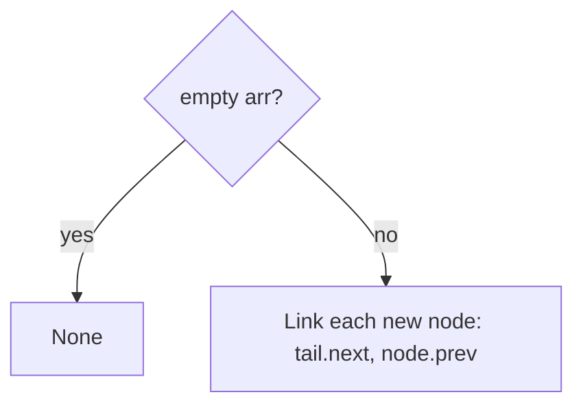

**Facts:** O(n) time, O(1) extra beyond nodes.

---

## 2. `convert_array_to_linked_list.py`

### Code (`array_to_linked_list`, `search_in_linked_list`)

```python
def array_to_linked_list(arr):
    if not arr:
        return None
    head = ListNode(arr[0])
    tail = head
    for i in range(1, len(arr)):
        tail.next = ListNode(arr[i])
        tail = tail.next
    return head


def search_in_linked_list(head, target):
    current = head
    while current:
        if current.val == target:
            return True
        current = current.next
    return False
```

### Flowchart

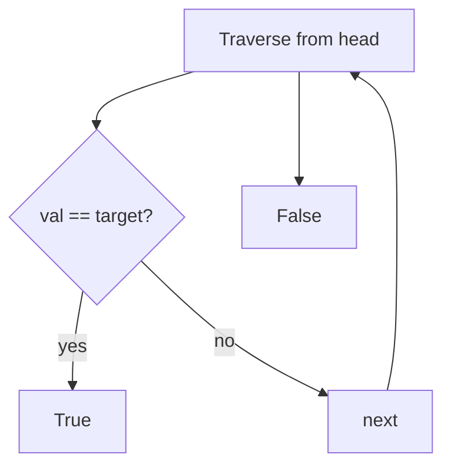

---

## 3. `doubly_linked_list_operations.py`

### Code (`add_at_head`)

```python
def add_at_head(head, val):
    node = DoublyListNode(val)
    if not head:
        return node
    node.next = head
    head.prev = node
    return node
```

**ASCII:** Doubly inserts fix **four** links (`next`/`prev` on both neighbors). See file for `add_at_tail`, `add_at_index`, deletes.

---

## 4. `insert_delete_linked_list.py`

### Code (`insert_at_head`)

```python
def insert_at_head(head, val):
    node = ListNode(val)
    node.next = head
    return node
```

See file for tail/index insert and deletes — same patterns as `MyLinkedList` in §15.

---

## 5. `leetcode_141_linked_list_cycle.py`

### Code

```python
class Solution(object):
    def hasCycle(self, head):
        if not head or not head.next:
            return False

        slow, fast = head, head.next
        while fast and fast.next:
            if slow == fast:
                return True
            slow = slow.next
            fast = fast.next.next

        return False
```

### Flowchart

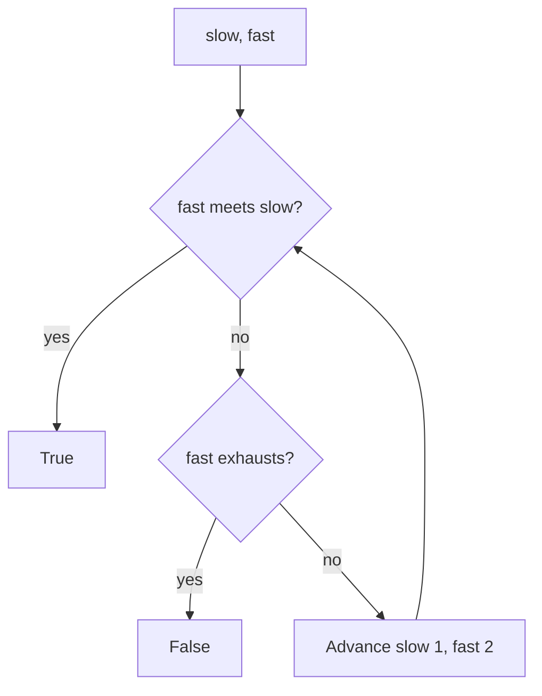

**Facts:** Floyd’s cycle detection; O(n) time, O(1) space.

---

## 6. `leetcode_160_intersection_of_two_linked_lists.py`

### Code

```python
class Solution(object):
    def getIntersectionNode(self, headA, headB):
        linked_list_map = {}

        while headA:
            linked_list_map[headA] = headA.val
            headA = headA.next

        while headB:
            if headB in linked_list_map:
                return headB
            headB = headB.next

        return None
```

### Flowchart

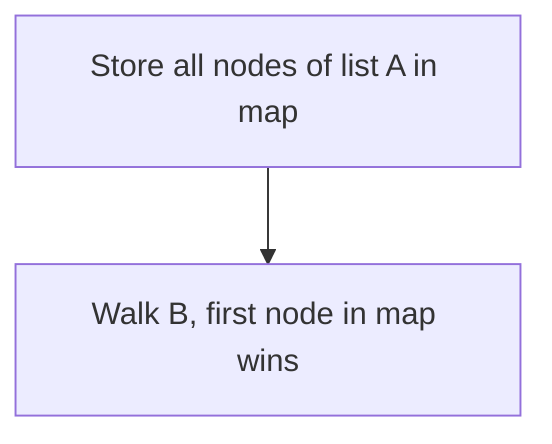

**Facts:** O(n+m) time, O(n) space; two-pointer O(1) space exists as alternative.

---

## 7. `leetcode_19_remove_nth_node_from_end_of_list.py`

### Code

```python
class Solution(object):
    def removeNthFromEnd(self, head, n):
        fast = slow = head

        for i in range(n):
            fast = fast.next

        if not fast:
            return head.next

        while fast.next:
            fast = fast.next
            slow = slow.next

        slow.next = slow.next.next

        return head
```

### Flowchart

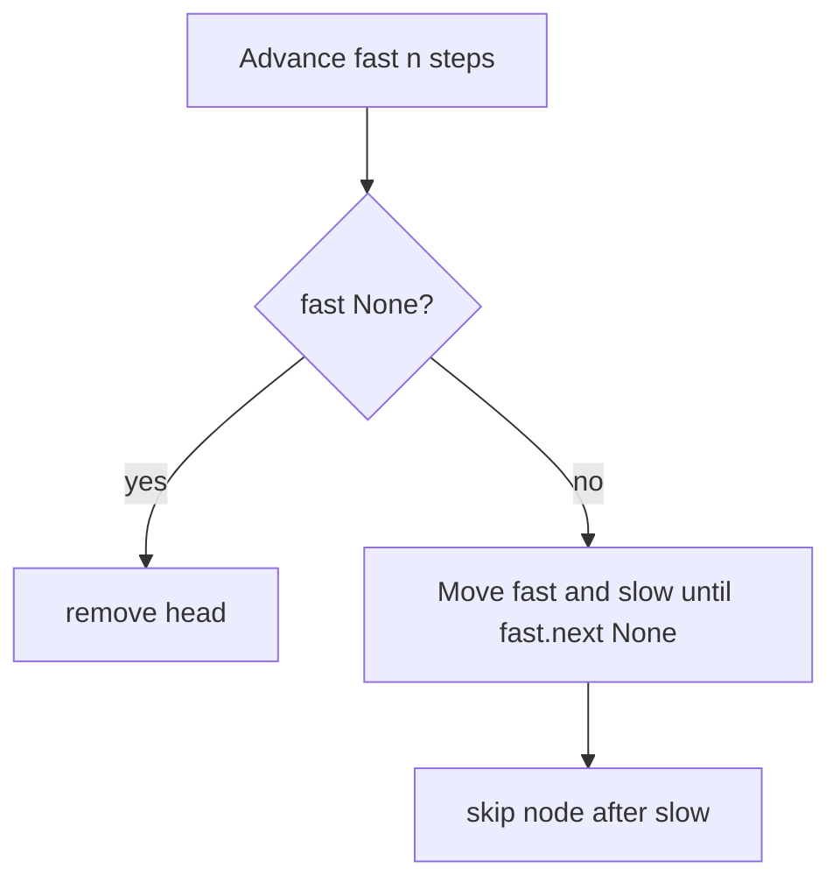

**Facts:** One pass after lead of n; O(n) time.

---

## 8. `leetcode_2_add_two_numbers.py`

### Code

```python
class Solution(object):
    def addTwoNumbers(self, l1, l2):
        head = None
        temp_pointer = None
        carry = 0

        while l1 or l2 or carry:
            element = (l1.val if l1 else 0) + (l2.val if l2 else 0) + carry
            carry = element // 10
            node = ListNode(element % 10)
            if head is None:
                head = node
            else:
                temp_pointer.next = node
            temp_pointer = node
            l1 = l1.next if l1 else None
            l2 = l2.next if l2 else None

        return head
```

### Flowchart

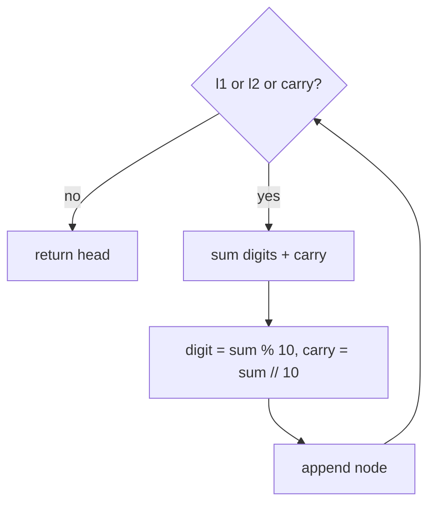

---

## 9. `leetcode_206_reverse_linked_list.py`

### Code

```python
class Solution(object):
    def reverseList(self, head):
        curr = head
        prev = None
        next = None

        while curr:
            next = curr.next
            curr.next = prev
            prev = curr
            curr = next

        return prev
```

### Flowchart

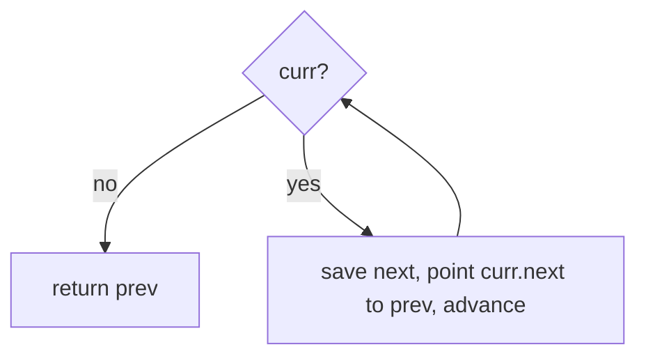

**Facts:** Iterative reverse; O(n) time, O(1) space.

---

## 10. `leetcode_21_merge_two_sorted_lists.py`

### Code

```python
class Solution:
    def mergeTwoLists(self, l1, l2):
        if l1 is None:
            return l2
        if l2 is None:
            return l1
        if l1.val < l2.val:
            l1.next = self.mergeTwoLists(l1.next, l2)
            return l1
        else:
            l2.next = self.mergeTwoLists(l1, l2.next)
            return l2
```

### Flowchart

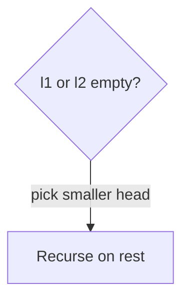

**Facts:** Recursive merge; O(n+m) time, O(n+m) stack worst case.

---

## 11. `leetcode_234_palindrome_linked_list.py`

### Code

```python
class Solution(object):
    def _reverse(self, head):
        curr, prev = head, None
        while curr:
            nxt = curr.next
            curr.next = prev
            prev, curr = curr, nxt
        return prev

    def _copy_list(self, head):
        ...

    def isPalindrome(self, head):
        orig = self._copy_list(head)
        rev = self._reverse(head)
        while orig:
            if orig.val != rev.val:
                return False
            orig, rev = orig.next, rev.next
        return True
```

### Flowchart

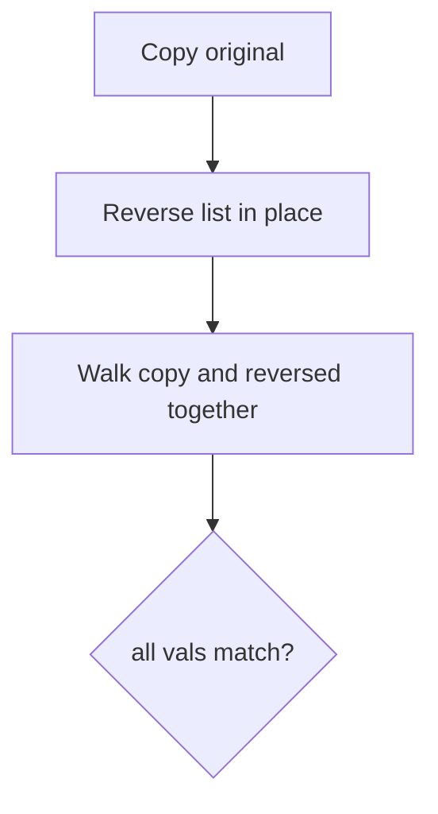

**Facts:** O(n) time; uses extra copy + mutates original via reverse (see file).

---

## 12. `leetcode_237_delete_node_in_a_linked_list.py`

### Code

```python
class Solution(object):
    def deleteNode(self, node):
        node.val = node.next.val
        node.next = node.next.next
```

### Flowchart

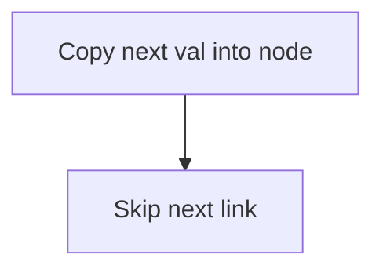

**Facts:** O(1) given access to node (not tail); cannot delete last node this way.

---

## 13. `leetcode_430_flatten_a_multilevel_doubly_linked_list.py`

### Code (stub)

```python
class Solution(object):
    def flatten(self, head):
        pass
```

**Revision note:** DFS or iterative: splice child list between `node` and `node.next`; maintain `prev`/`next` for doubly linked structure.

---

## 14. `leetcode_445_add_two_numbers_ii.py`

### Code

```python
class Solution(object):
    def reverse_ll(self, head):
        ...

    def addTwoNumbers(self, l1, l2):
        head = None
        temp_pointer = None
        carry = 0
        l1 = self.reverse_ll(l1)
        l2 = self.reverse_ll(l2)
        while l1 or l2 or carry:
            ...
        return self.reverse_ll(head)
```

### Flowchart

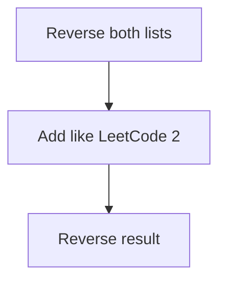

---

## 15. `leetcode_707_design_linked_list.py`

### Code (`get`, `addAtHead`)

```python
    def get(self, index):
        if index < 0:
            return -1
        curr = self.head
        for _ in range(index):
            if curr is None:
                return -1
            curr = curr.next
        if curr is None:
            return -1
        return curr.val

    def addAtHead(self, val):
        node = ListNode(val)
        node.next = self.head
        self.head = node
```

See file for `addAtTail`, `addAtIndex`, `deleteAtIndex` — classic singly-linked ops with `self.head`.

---

## 16. `leetcode_83_remove_duplicates_from_sorted_list.py`

### Code

```python
class Solution(object):
    def deleteDuplicates(self, head):
        current = head
        while current:
            while current.next and current.next.val == current.val:
                current.next = current.next.next
            current = current.next
        return head
```

### Flowchart

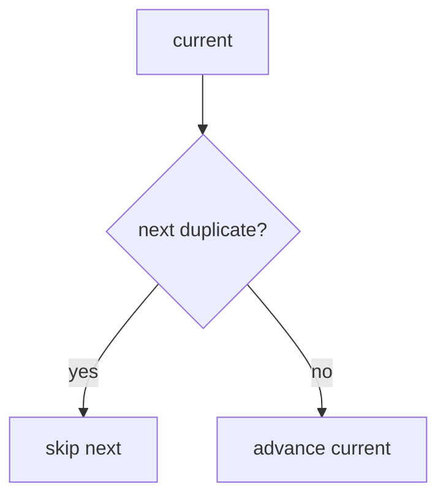

---

## 17. `leetcode_876_middle_of_the_linked_list.py`

### Code

```python
class Solution(object):
    def middleNode(self, head):
        fast = head
        slow = head
        while fast and fast.next:
            fast = fast.next.next
            slow = slow.next
        return slow
```

### Flowchart

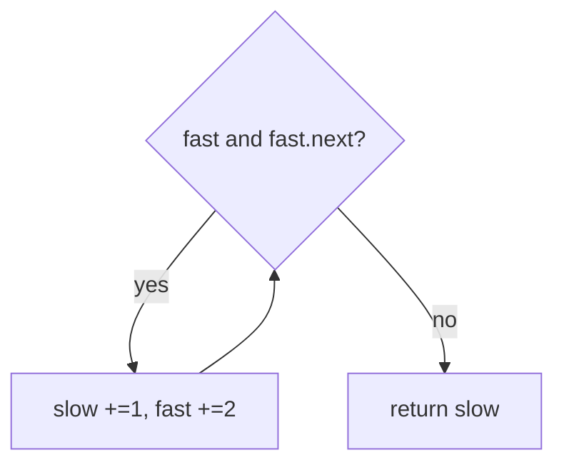

**Facts:** Two pointers; second middle when even length.

---

## 18. `leetcode_2095_delete_the_middle_node_of_a_linked_list.py`

### Code

```python
class Solution(object):
    def deleteMiddle(self, head):
        slow = fast = head
        if not head:
            return None
        if head.next is None:
            return None
        while fast and fast.next:
            prev = slow
            fast = fast.next.next
            slow = slow.next
        prev.next = slow.next
        return head
```

### Flowchart

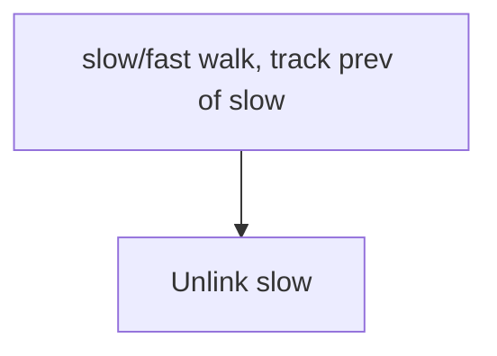

**Facts:** Remove middle; O(n) time.

---

## More topics

[TREES_FLOWCHARTS.md](../trees/TREES_FLOWCHARTS.md) · [STACK_FLOWCHARTS.md](../stack/STACK_FLOWCHARTS.md)
