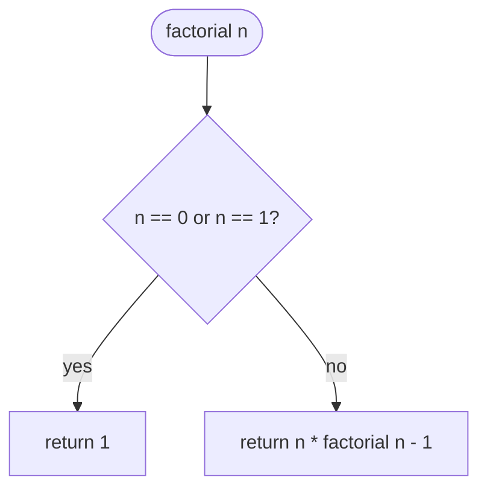
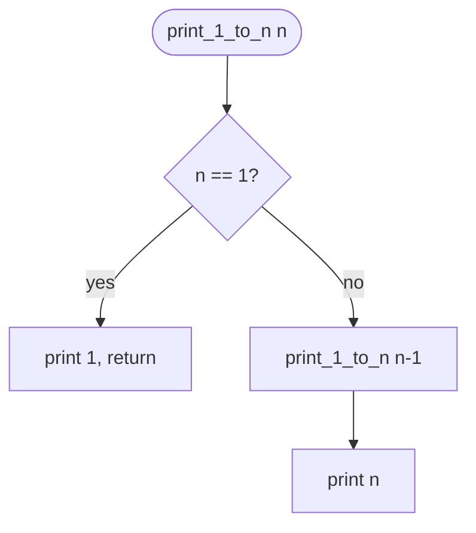
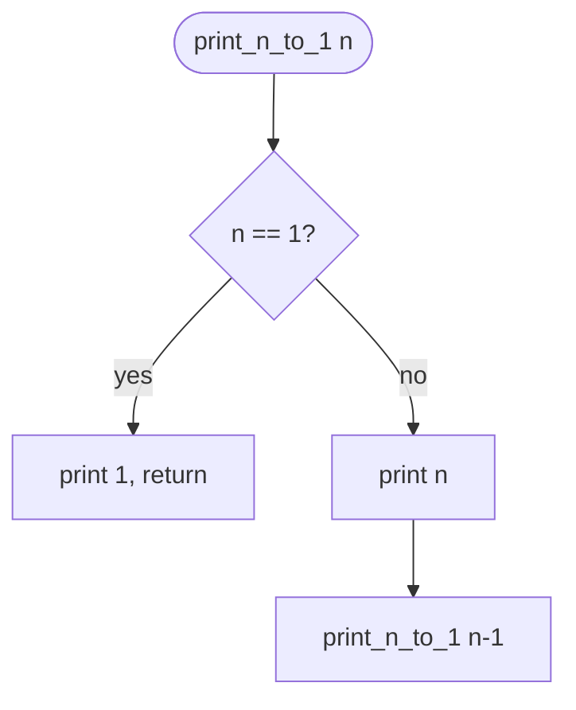
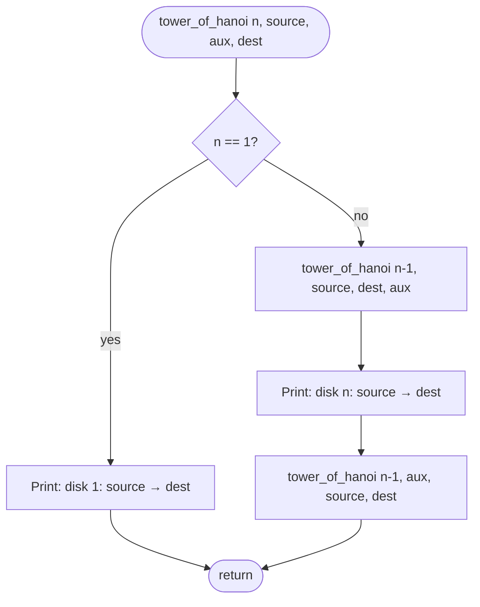
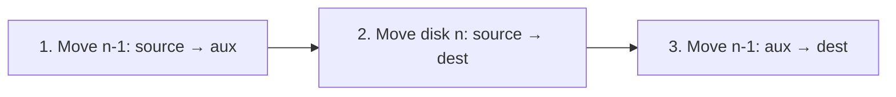
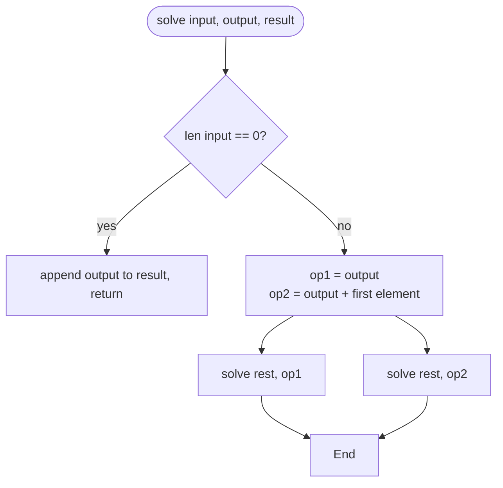
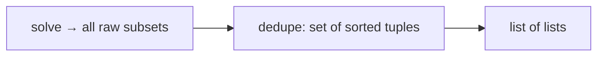
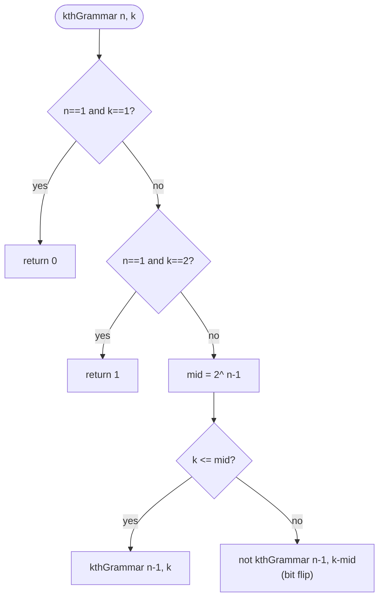
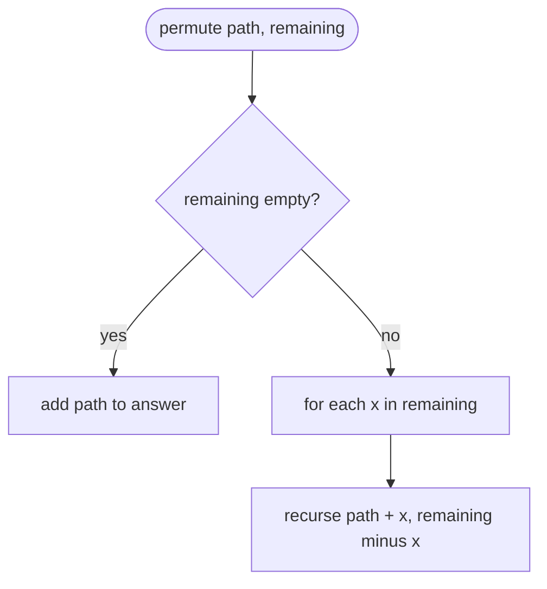

# Recursion & backtracking — revision flowcharts

Each section shows the **code from the repo first**, then the **flowchart** (Mermaid + ASCII). Mermaid renders on GitHub and in many Markdown previews (Mermaid extension).

**Contents:** [Factorial](#1-factorial_using_recursionpy) · [Print 1..n / n..1](#2-print_numbers_using_recursionpy) · [Tower of Hanoi](#3-tower_of_hanoipy) · [LeetCode 78 Subsets](#4-leetcode_78_subsetspy) · [LeetCode 90 Subsets II](#5-leetcode_90_subsets_iipy) · [LeetCode 779 K-th Symbol](#6-leetcode_779_kth_symbol_in_grammarpy) · [LeetCode 46 Permutations](#7-leetcode_46_permutationspy-planned)

---

## 1. `factorial_using_recursion.py`

### Code

```python
def factorial(n):
    if n == 1 or n == 0:
        return 1

    return n * factorial(n - 1)
```

### Flowchart



**ASCII**

```
factorial(n)
  |-- n in {0,1} --> 1
  `-- else       --> n * factorial(n-1)
```

**Facts:** Time O(n), space O(n) call stack.

---

## 2. `print_numbers_using_recursion.py`

### Code

```python
def print_1_to_n(n):
    if n == 1:
        print(1)
        return

    print_1_to_n(n - 1)
    print(n)


def print_n_to_1(n):
    if n == 1:
        print(1)
        return

    print(n)
    print_n_to_1(n - 1)
```

### Flowchart — `print_1_to_n` (ascending: recurse first, print on unwind)



### Flowchart — `print_n_to_1` (descending: print before recurse)



**Facts:** Time O(n), space O(n) stack each.

---

## 3. `tower_of_hanoi.py`

### Code

```python
def tower_of_hanoi(n, source, aux, dest):
    if n == 1:
        print(f"Move disk 1 from {source} to {dest}")
        return

    tower_of_hanoi(n - 1, source, dest, aux)   # move n-1 from source to aux (using dest)
    print(f"Move disk {n} from {source} to {dest}")
    tower_of_hanoi(n - 1, aux, source, dest)   # move n-1 from aux to dest (using source)
```

### Flowchart

Pegs: `source`, `aux`, `dest`.





| Recursive call | Role |
|----------------|------|
| `(..., source, dest, aux)` | **dest** is spare while moving n−1 to **aux**. |
| `(..., aux, source, dest)` | **source** is spare while moving n−1 to **dest**. |

**ASCII**

```
tower_of_hanoi(n, source, aux, dest)
  |-- n == 1 --> print disk 1: source -> dest
  `-- else:
        tower_of_hanoi(n-1, source, dest, aux)
        print disk n: source -> dest
        tower_of_hanoi(n-1, aux, source, dest)
```

**Facts:** `2^n - 1` moves; time Θ(2^n) moves; space O(n).

---

## 4. `leetcode_78_subsets.py`

### Code

```python
class Solution(object):
    def subsets(self, nums):
        input_arr = nums
        output_arr = []
        result = []
        self.solve(input_arr, output_arr, result)
        return list(map(list, set(map(tuple, result))))

    def solve(self, input_arr, output_arr, result):
        if len(input_arr) == 0:
            result.append(output_arr)
            return

        op1 = output_arr
        op2 = output_arr + [input_arr[0]]

        self.solve(input_arr[1:], op1, result)
        self.solve(input_arr[1:], op2, result)
```

### Flowchart

`solve(input_arr, output_arr, result)` — power set via include / exclude first element.



**ASCII**

```
solve(input, output, result):
  if input empty: result += [output]; return
  solve(input[1:], output,           result)   # exclude
  solve(input[1:], output + [input[0]], result)   # include
```

**Note:** `subsets()` also dedupes via `set` of tuples before return.

**Facts:** Time O(n · 2^n) typical for building all subsets; recursion depth O(n).

---

## 5. `leetcode_90_subsets_ii.py`

### Code

```python
class Solution(object):
    def subsetsWithDup(self, nums):
        input_arr = nums
        output_arr = []
        result = []
        self.solve(input_arr, output_arr, result)
        return list(map(list, set(tuple(sorted(sub)) for sub in result)))

    def solve(self, input_arr, output_arr, result):
        if len(input_arr) == 0:
            result.append(output_arr)
            return

        op1 = output_arr
        op2 = output_arr + [input_arr[0]]

        self.solve(input_arr[1:], op1, result)
        self.solve(input_arr[1:], op2, result)
```

### Flowchart

Same recursion tree as LeetCode 78 (`solve` include/exclude). **Difference:** after recursion, dedupe with sorted tuples in a set.



**Facts:** Extra dedup work; see docstring in file for time/space.

---

## 6. `leetcode_779_kth_symbol_in_grammar.py`

### Code

```python
class Solution(object):
    def kthGrammar(self, n, k):
        if n == 1 and k == 1:
            return 0

        if n == 1 and k == 2:
            return 1

        mid = 2 ** (n - 1)
        if k <= mid:
            return self.kthGrammar(n - 1, k)
        else:
            return int(not (self.kthGrammar(n - 1, k - mid)))
```

### Flowchart

Matches current code: `mid = 2 ** (n - 1)`; bases `(1,1)→0`, `(1,2)→1`.



**ASCII**

```
kthGrammar(n, k):
  if n==1 and k==1: return 0
  if n==1 and k==2: return 1
  mid = 2^(n-1)
  if k <= mid: return kthGrammar(n-1, k)
  else: return 1 - kthGrammar(n-1, k - mid)   # flip 0/1
```

**Facts:** Time O(n), space O(n) stack.

---

## 7. `leetcode_46_permutations.py` (planned)

### Code (current stub)

```python
class Solution(object):
    def permute(self, nums):
        pass
```

### Typical backtracking you would implement

```python
def backtrack(path, remaining, out):
    if not remaining:
        out.append(list(path))
        return
    for i, x in enumerate(remaining):
        backtrack(path + [x], remaining[:i] + remaining[i + 1 :], out)
```

### Flowchart



**ASCII**

```
backtrack(current, unused):
  if unused empty: save current
  else: for each v in unused:
          backtrack(current + [v], unused \ {v})
```

**Facts (when implemented):** O(n! · n) time, O(n) recursion depth (output aside).

---

## More topics in this repo

Flowcharts for **arrays, DP, trees,** etc. are not in this file. If you want the same style for another folder, add e.g. `dynamic_programming/DP_FLOWCHARTS.md` or ask to generate the next batch.
