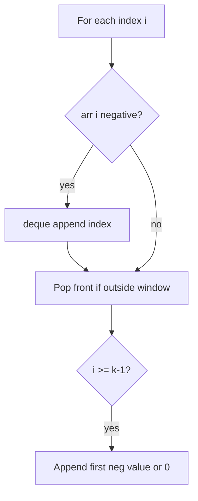
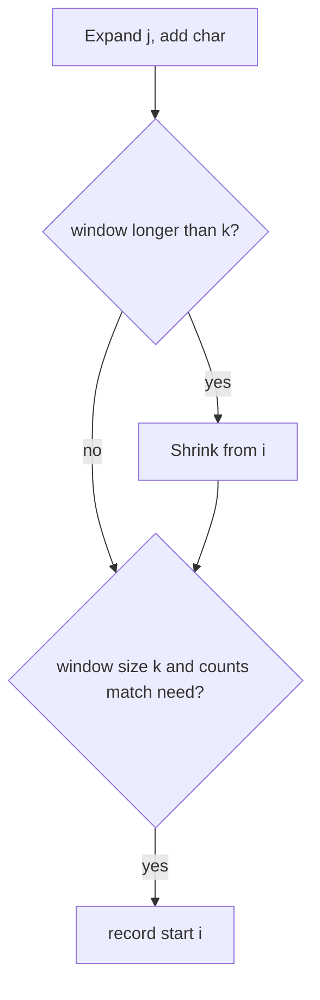
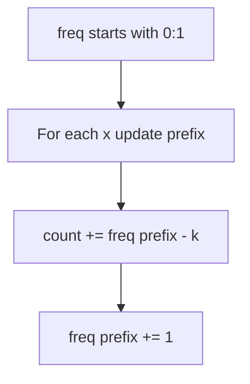
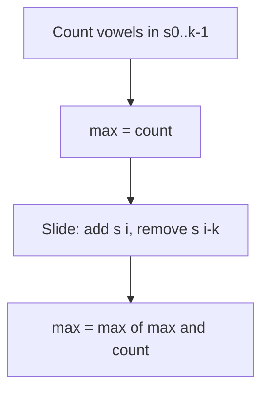
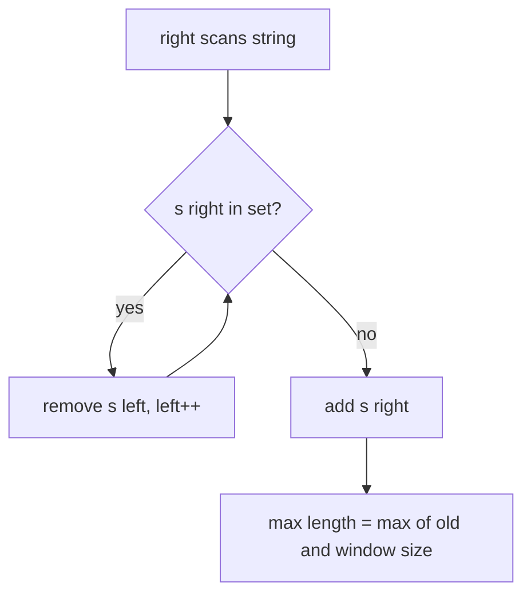
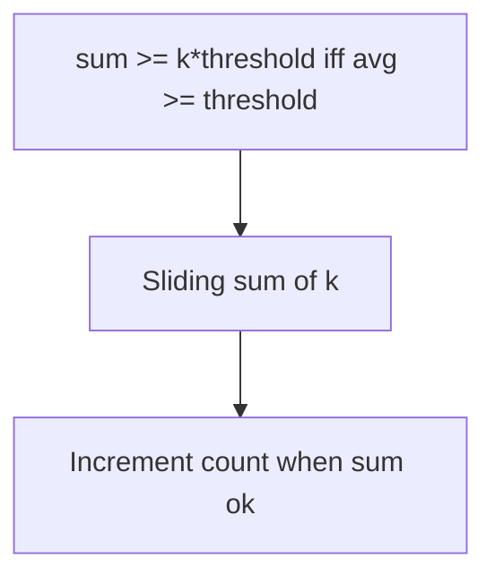
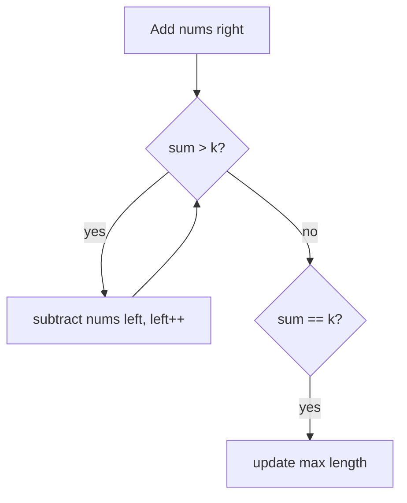
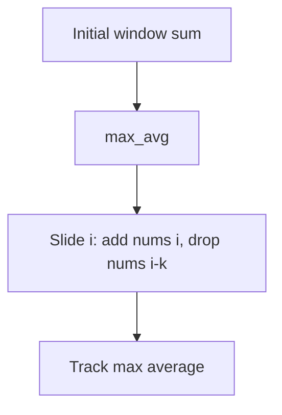
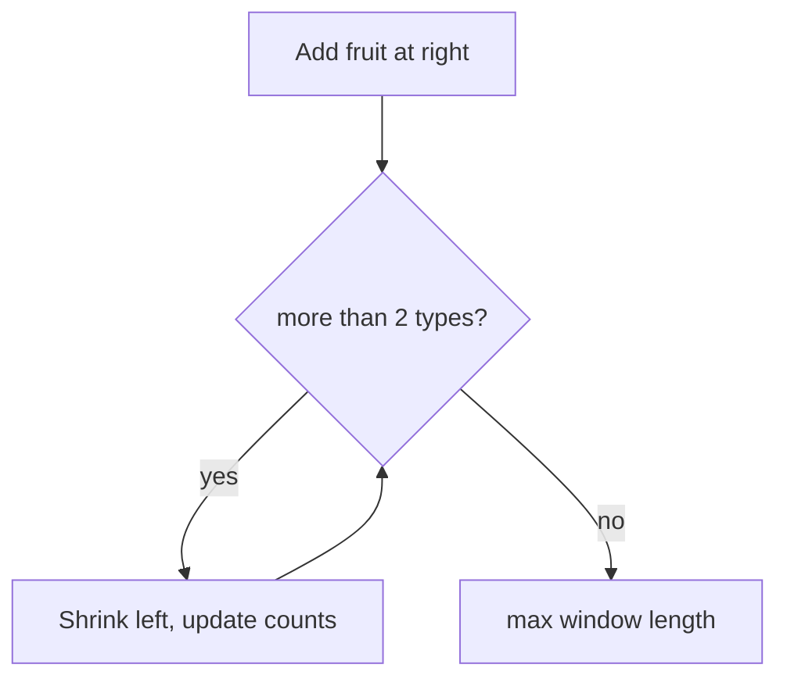
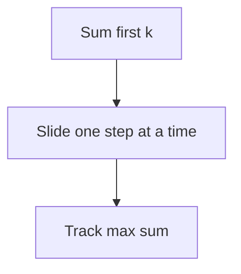

# Sliding window — revision flowcharts

Each section shows **code from the repo first**, then **Mermaid** (and ASCII where helpful).

**Contents:** [First negative in window k](#1-first_negative_in_every_window_of_size_kpy) · [438 Anagrams](#2-leetcode_438_find_all_anagrams_in_a_stringpy) · [560 Subarray sum k](#3-leetcode_560_subarray_sum_equals_kpy) · [1456 Max vowels k](#4-leetcode_1456_maximum_number_of_vowels_in_substring_of_given_lengthpy) · [3 Longest unique substring](#5-leetcode_3_longest_substring_without_repeating_characterspy) · [1343 Count windows avg](#6-leetcode_1343_num_of_subarrays_of_size_k_avg_ge_thresholdpy) · [Longest subarray sum k](#7-longest_subarray_with_sum_kpy) · [643 Max average I](#8-leetcode_643_maximum_average_subarray_ipy) · [904 Fruit baskets](#9-leetcode_904_fruit_into_basketspy) · [340 At most k distinct](#10-leetcode_340_longest_substring_at_most_k_distinctpy) · [Max sum window k](#11-maximum_sum_subarray_of_size_kpy)

---

## 1. `first_negative_in_every_window_of_size_k.py`

### Code

```python
class Solution(object):
    def firstNegativeInWindow(self, arr, k):
        result = []
        temp_result = deque()

        for i in range(len(arr)):
            if arr[i] < 0:
                temp_result.append(i)

            if temp_result and temp_result[0] <= i - k:
                temp_result.popleft()

            if i >= k - 1:
                if temp_result:
                    result.append(arr[temp_result[0]])
                else:
                    result.append(0)

        return result
```

### Flowchart



**Facts:** Deque stores indices of negatives in window; O(n) time.

---

## 2. `leetcode_438_find_all_anagrams_in_a_string.py`

### Code

```python
class Solution(object):
    def findAnagrams(self, s, p):
        k = len(p)
        need = Counter(p)
        window = Counter()

        result = []
        i = 0

        for j in range(len(s)):
            window[s[j]] += 1

            if j - i + 1 > k:
                window[s[i]] -= 1
                if window[s[i]] == 0:
                    del window[s[i]]
                i += 1

            if j - i + 1 == k and window == need:
                result.append(i)

        return result
```

### Flowchart



**Facts:** O(n) time; `Counter` compare when window length equals k.

---

## 3. `leetcode_560_subarray_sum_equals_k.py`

### Code (prefix sum + hash map, not two-pointer window)

```python
class Solution(object):
    def subarraySum(self, nums, k):
        count = 0
        prefix_sum = 0
        freq = {0: 1}
        for x in nums:
            prefix_sum += x
            count += freq.get(prefix_sum - k, 0)
            freq[prefix_sum] = freq.get(prefix_sum, 0) + 1
        return count
```

### Flowchart



**Facts:** Handles negatives; O(n) time, O(n) map.

---

## 4. `leetcode_1456_maximum_number_of_vowels_in_substring_of_given_length.py`

### Code

```python
class Solution(object):
    def maxVowels(self, s, k):
        vowels = set("aeiou")
        if not s or k <= 0 or k > len(s):
            return 0
        count = sum(1 for c in s[:k] if c in vowels)
        max_count = count
        for i in range(k, len(s)):
            if s[i] in vowels:
                count += 1
            if s[i - k] in vowels:
                count -= 1
            max_count = max(max_count, count)
        return max_count
```

### Flowchart



**Facts:** Fixed-size window; O(n) time, O(1) space.

---

## 5. `leetcode_3_longest_substring_without_repeating_characters.py`

### Code

```python
class Solution(object):
    def lengthOfLongestSubstring(self, s):
        char_set = set()
        left = 0
        max_length = 0

        for right in range(len(s)):
            while s[right] in char_set:
                char_set.remove(s[left])
                left += 1

            char_set.add(s[right])
            max_length = max(max_length, right - left + 1)
        return max_length
```

### Flowchart



**Facts:** Variable window; O(n) time.

---

## 6. `leetcode_1343_num_of_subarrays_of_size_k_avg_ge_threshold.py`

### Code

```python
class Solution(object):
    def numOfSubarrays(self, arr, k, threshold):
        target = k * threshold
        window_sum = sum(arr[:k])
        count = 1 if window_sum >= target else 0
        for i in range(k, len(arr)):
            window_sum = window_sum + arr[i] - arr[i - k]
            count = count + 1 if window_sum >= target else count

        return count
```

### Flowchart



**Facts:** O(n) time, O(1) space.

---

## 7. `longest_subarray_with_sum_k.py`

### Code (non-negative nums only)

```python
def longestSubarray(nums, k):
    left = 0
    current_sum = 0
    max_length = 0

    for right in range(len(nums)):
        current_sum += nums[right]

        while current_sum > k and left <= right:
            current_sum -= nums[left]
            left += 1

        if current_sum == k:
            max_length = max(max_length, right - left + 1)

    return max_length
```

### Flowchart



**Facts:** Two pointers valid only for **non-negative** elements.

---

## 8. `leetcode_643_maximum_average_subarray_i.py`

### Code — approach 1

```python
    def findMaxAverage(self, nums, k):
        sum_array = []
        for i in range(len(nums)):
            if len(nums[i:i+k]) >= k:
                sum_array.append(sum(nums[i:i+k]) / float(k))
        return max(sum_array)
```

### Code — approach 2 (sliding window)

```python
    def findMaxAverage2(self, nums, k):
        if not nums or k <= 0 or k > len(nums):
            return 0.0
        window_sum = sum(nums[:k])
        max_avg = window_sum / float(k)
        for i in range(k, len(nums)):
            window_sum = window_sum + nums[i] - nums[i - k]
            max_avg = max(max_avg, window_sum / float(k))
        return max_avg
```

### Flowchart — approach 2



**Facts:** Approach 1 O(n·k); approach 2 O(n).

---

## 9. `leetcode_904_fruit_into_baskets.py`

### Code

```python
class Solution(object):
    def totalFruit(self, fruits):
        left = 0
        freq_map = {}
        max_count = 0

        for right in range(len(fruits)):
            char = fruits[right]
            freq_map[char] = freq_map.get(char, 0) + 1

            while len(freq_map) > 2:
                freq_map[fruits[left]] -= 1
                if freq_map[fruits[left]] == 0:
                    del freq_map[fruits[left]]
                left += 1

            max_count = max(max_count, right - left + 1)

        return max_count
```

### Flowchart



**Facts:** Longest subarray with ≤ 2 distinct values; O(n) time.

---

## 10. `leetcode_340_longest_substring_at_most_k_distinct.py`

### Code

```python
class Solution(object):
    def lengthOfLongestSubstringKDistinct(self, s, k):
        left = 0
        freq_map = {}
        max_length = 0

        for right in range(len(s)):
            char = s[right]
            freq_map[char] = freq_map.get(char, 0) + 1

            while len(freq_map) > k:
                freq_map[s[left]] -= 1
                if freq_map[s[left]] == 0:
                    del freq_map[s[left]]
                left += 1

            max_length = max(max_length, right - left + 1)

        return max_length
```

### Flowchart

Same structure as §9 with **k** instead of 2.

**Facts:** O(n) time; generalization of fruit-into-baskets.

---

## 11. `maximum_sum_subarray_of_size_k.py`

### Code

```python
class Solution(object):
    def maxSumSubarray(self, nums, k):
        if not nums or k <= 0 or k > len(nums):
            return 0
        max_sum = sum(nums[:k])
        window_sum = max_sum

        for i in range(k, len(nums)):
            window_sum = window_sum + nums[i] - nums[i - k]
            max_sum = max(max_sum, window_sum)

        return max_sum
```

### Flowchart



**Facts:** Classic fixed window; O(n) time, O(1) space.

---

## More topics

[STRINGS_FLOWCHARTS.md](../strings/STRINGS_FLOWCHARTS.md) · [BINARY_SEARCH_FLOWCHARTS.md](../binary_search/BINARY_SEARCH_FLOWCHARTS.md)
