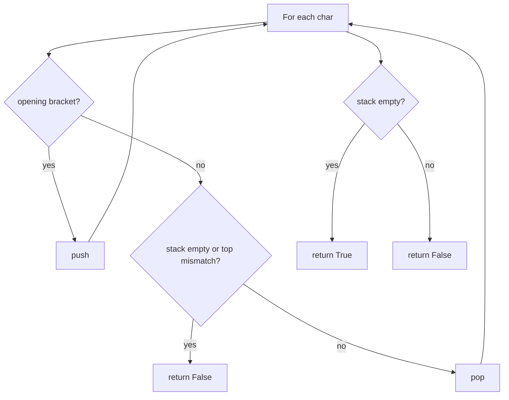
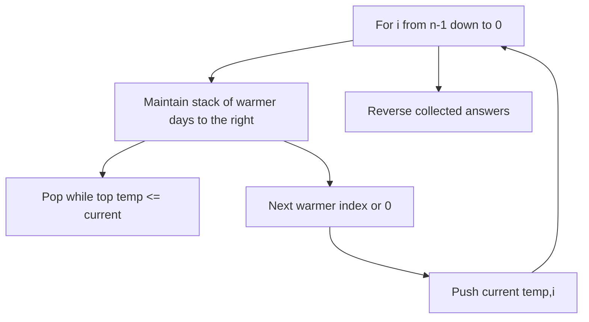
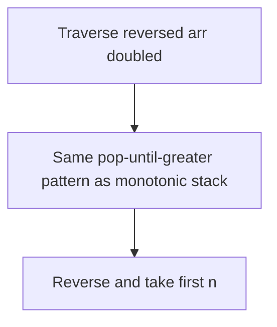
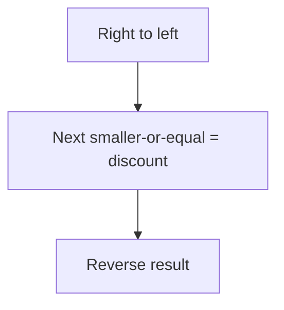
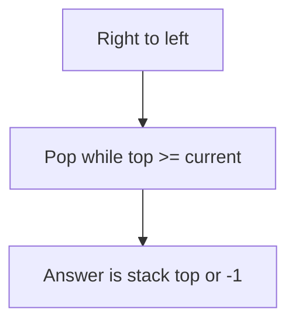
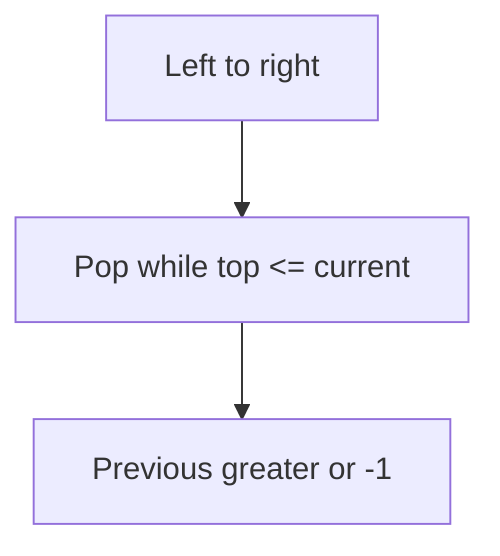
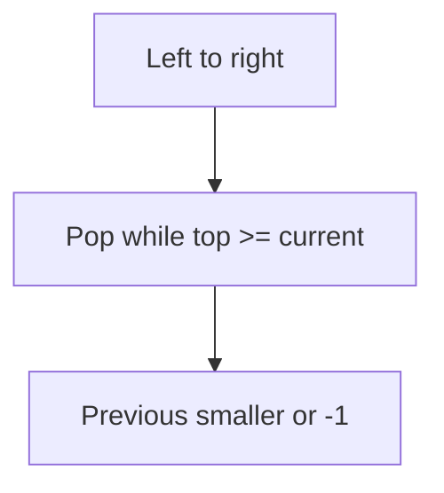

# Stack — revision flowcharts

Each section shows **code from the repo first**, then **Mermaid** (and ASCII where helpful).

**Contents:** [Valid parentheses](#1-leetcode_20_valid_parenthesespy) · [Daily temperatures](#2-leetcode_739_daily_temperaturespy) · [Next greater II](#3-leetcode_503_next_largest_elementpy) · [Final prices / discount](#4-leetcode_1457_final_price_with_special_discountpy) · [Next smaller](#5-next_smaller_elementpy) · [Prev greater](#6-prev_greater_elementpy) · [Prev smaller](#7-prev_smaller_elementpy)

---

## 1. `leetcode_20_valid_parentheses.py`

### Code

```python
class Solution(object):
    def isValid(self, s):
        mapping = {')': '(', '}': '{', ']': '['}
        stack = []

        for char in s:
            if char in mapping.values():
                stack.append(char)
            elif char in mapping:
                if not stack or mapping[char] != stack.pop():
                    return False
        return not stack
```

### Flowchart



**Facts:** O(n) time, O(n) stack space.

---

## 2. `leetcode_739_daily_temperatures.py`

### Code (reversed walk + stack of `(temp, index)`)

```python
class Solution(object):
    def dailyTemperatures(self, temperatures):
        result = []
        stack = []

        for i in reversed(range(len(temperatures))):
            if not stack:
                result.append(0)

            if stack and stack[-1][0] > temperatures[i]:
                result.append(stack[-1][1] - i)

            if stack and stack[-1][0] <= temperatures[i]:
                while stack and stack[-1][0] <= temperatures[i]:
                    stack.pop()
                if not stack:
                    result.append(0)
                else:
                    result.append(stack[-1][1] - i)

            stack.append([temperatures[i], i])

        return result[::-1]
```

### Flowchart



**Facts:** Monotonic stack from the right; O(n) amortized.

---

## 3. `leetcode_503_next_largest_element.py`

### Code

```python
class Solution():
    def nextGreaterElements(self, arr):
        stack = []
        result = []

        for element in reversed(arr+arr):
            if not stack:
                result.append(-1)

            if stack and stack[-1] > element:
                result.append(stack[-1])

            if stack and stack[-1] <= element:
                while stack and stack[-1] <= element:
                    stack.pop()
                if not stack:
                    result.append(-1)
                else:
                    result.append(stack[-1])

            stack.append(element)

        return result[::-1][:len(arr)]
```

### Flowchart



**Facts:** Circular array simulated by `arr + arr`; O(n) amortized over 2n steps.

---

## 4. `leetcode_1457_final_price_with_special_discount.py`

### Code

```python
class Solution(object):
    def finalPrices(self, prices):
        stack = []
        result = []

        for element in reversed(prices):
            if not stack:
                result.append(element)

            if stack and stack[-1] <= element:
                result.append(element - stack[-1])

            if stack and stack[-1] > element:
                while stack and stack[-1] > element:
                    stack.pop()
                if not stack:
                    result.append(element)
                else:
                    result.append(element - stack[-1])

            stack.append(element)

        return result[::-1]
```

### Flowchart



**Facts:** “Next smaller or equal” to the right; O(n) amortized.

---

## 5. `next_smaller_element.py`

### Code

```python
class Solution():
    def nextSmallerElement(self, arr):
        stack = []
        result = []

        for element in reversed(arr):
            if not stack:
                result.append(-1)

            if stack and stack[-1] < element:
                result.append(stack[-1])

            if stack and stack[-1] >= element:
                while stack and stack[-1] >= element:
                    stack.pop()
                if not stack:
                    result.append(-1)
                else:
                    result.append(stack[-1])

            stack.append(element)

        return result[::-1]
```

### Flowchart



**Facts:** Next strictly smaller to the right.

---

## 6. `prev_greater_element.py`

### Code

```python
class Solution():
    def prevGreaterElement(self, arr):
        stack = []
        result = []

        for element in arr:
            if not stack:
                result.append(-1)

            if stack and stack[-1] > element:
                result.append(stack[-1])

            if stack and stack[-1] <= element:
                while stack and stack[-1] <= element:
                    stack.pop()
                if not stack:
                    result.append(-1)
                else:
                    result.append(stack[-1])

            stack.append(element)

        return result
```

### Flowchart



**Facts:** No reverse of result; O(n) amortized.

---

## 7. `prev_smaller_element.py`

### Code

```python
class Solution():
    def prevSmallerElement(self, arr):
        stack = []
        result = []

        for element in arr:
            if not stack:
                result.append(-1)

            if stack and stack[-1] < element:
                result.append(stack[-1])

            if stack and stack[-1] >= element:
                while stack and stack[-1] >= element:
                    stack.pop()
                if not stack:
                    result.append(-1)
                else:
                    result.append(stack[-1])

            stack.append(element)

        return result
```

### Flowchart



**Facts:** Mirror of §6 with `>=` / `<` flipped for “smaller”.

---

## More topics

[SLIDING_WINDOW_FLOWCHARTS.md](../sliding_window/SLIDING_WINDOW_FLOWCHARTS.md) · [LINKED_LIST_FLOWCHARTS.md](../linked_list/LINKED_LIST_FLOWCHARTS.md)
