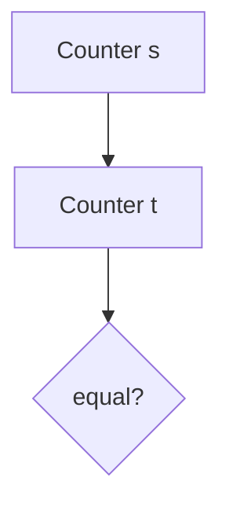
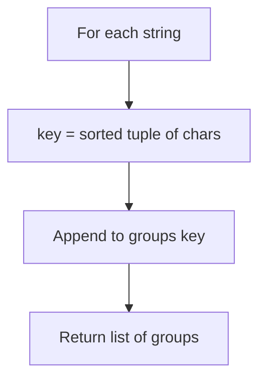
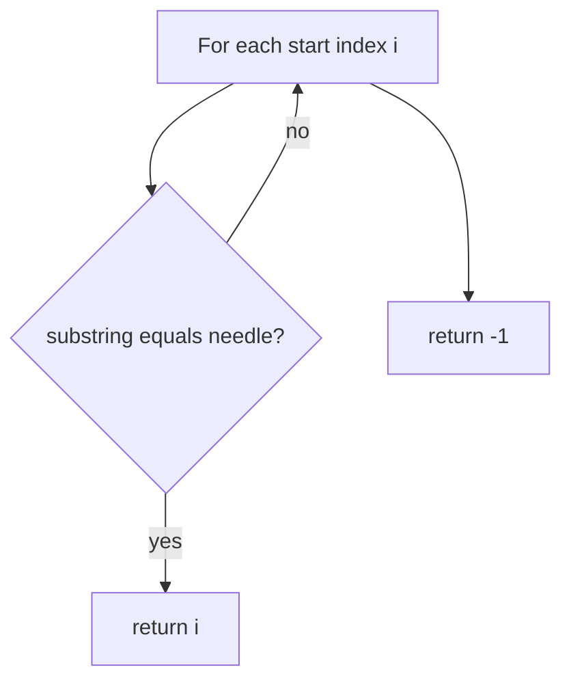
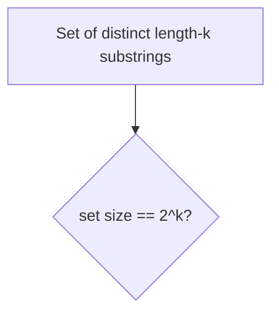
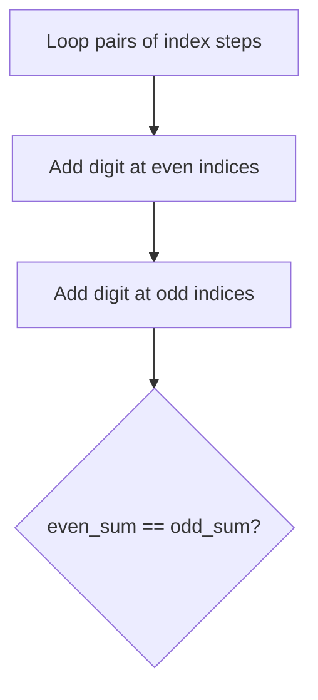

# Strings — revision flowcharts

Folder: **`strings/`** (plural). Each section: **code from the repo first**, then **Mermaid** where it helps.

**Contents:** [242 Valid anagram](#1-leetcode_242_valid_anagrampy) · [49 Group anagrams](#2-leetcode_49_group_anagramspy) · [28 strStr](#3-leetcode_28_find_index_of_first_occurrence_in_stringpy) · [1461 All binary codes k](#4-leetcode_1461_check_if_string_contains_all_binary_codes_of_size_kpy) · [3340 Balanced string](#5-leetcode_3340_check_balanced_stringpy)

---

## 1. `leetcode_242_valid_anagram.py`

### Code

```python
class Solution(object):
    def isAnagram(self, s, t):
        return Counter(s) == Counter(t)
```

### Flowchart



**Facts:** O(n) time; O(σ) keys (≤ 26 for lowercase English).

---

## 2. `leetcode_49_group_anagrams.py`

### Code

```python
class Solution(object):
    def groupAnagrams(self, strs):
        groups = {}
        for s in strs:
            key = tuple(sorted(s))
            if key not in groups:
                groups[key] = []
            groups[key].append(s)
        return list(groups.values())
```

### Flowchart



**Facts:** O(n · k log k) per string length k.

---

## 3. `leetcode_28_find_index_of_first_occurrence_in_string.py`

### Code

```python
class Solution(object):
    def strStr(self, haystack, needle):
        for i in range(len(haystack)):
            if needle == haystack[i:i + len(needle)]:
                return i
        return -1
```

### Flowchart



**Facts:** O(n·m) worst case; O(m) slice space per check.

---

## 4. `leetcode_1461_check_if_string_contains_all_binary_codes_of_size_k.py`

### Code

```python
class Solution(object):
    def hasAllCodes(self, s, k):
        n = len(s)
        candiadates = set()

        for i in range(n - k + 1):
            sub = s[i: i + k]
            if sub not in candiadates:
                candiadates.add(sub)

        length = len(candiadates)

        return 2 ** k == length
```

### Flowchart



**Facts:** All binary k-tuples must appear; O(n·k) substring work unless optimized.

---

## 5. `leetcode_3340_check_balanced_string.py`

### Code

```python
class Solution(object):
    def isBalanced(self, num):
        odd_sum, even_sum = 0, 0
        even_counter, odd_counter = 0, 1

        for _ in range((len(num) + 1) // 2):
            if even_counter < len(num):
                even_sum += int(num[even_counter])
            if odd_counter < len(num):
                odd_sum += int(num[odd_counter])
            even_counter += 2
            odd_counter += 2

        return even_sum == odd_sum
```

### Flowchart



**Facts:** O(n) time, O(1) space.

---

## More topics

[SLIDING_WINDOW_FLOWCHARTS.md](../sliding_window/SLIDING_WINDOW_FLOWCHARTS.md) · [STACK_FLOWCHARTS.md](../stack/STACK_FLOWCHARTS.md)
