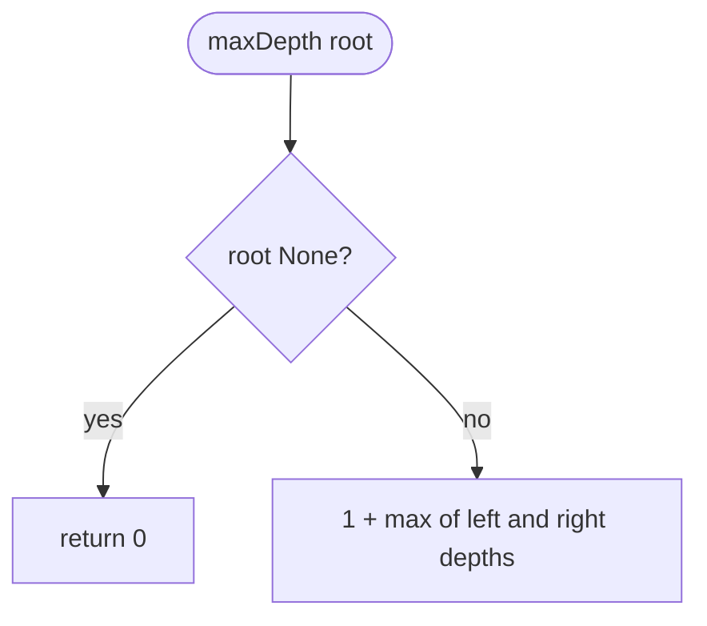
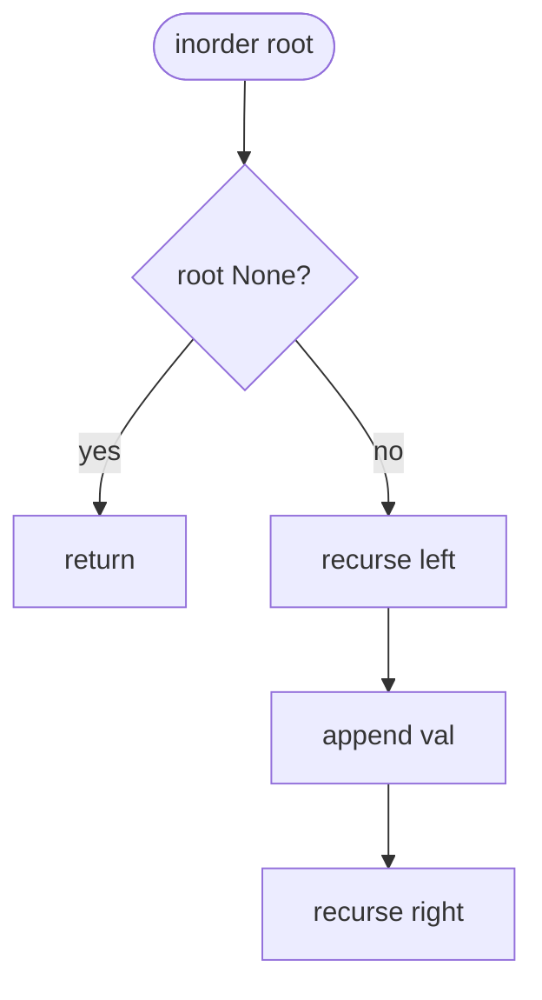
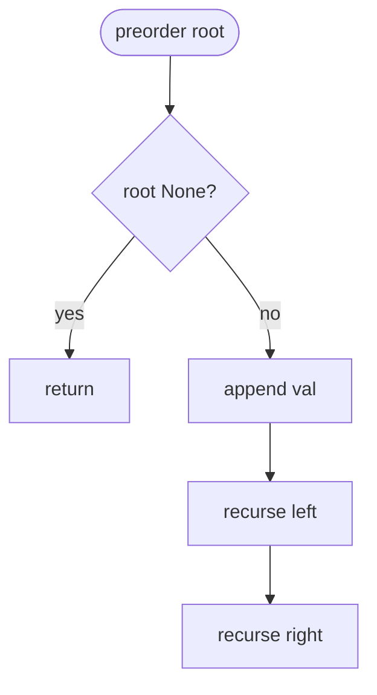
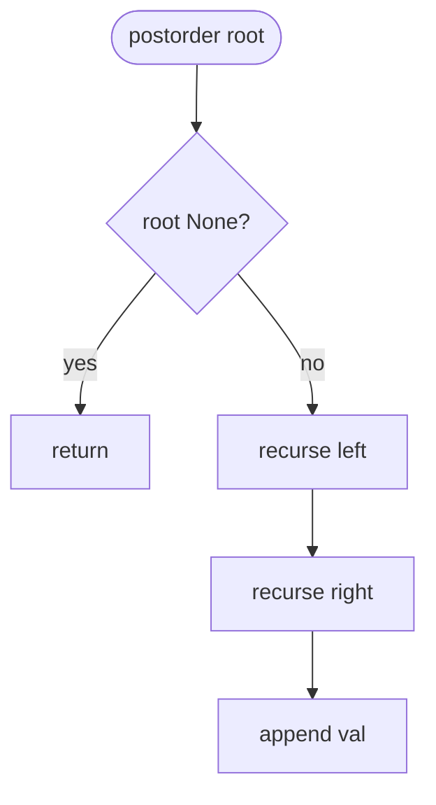
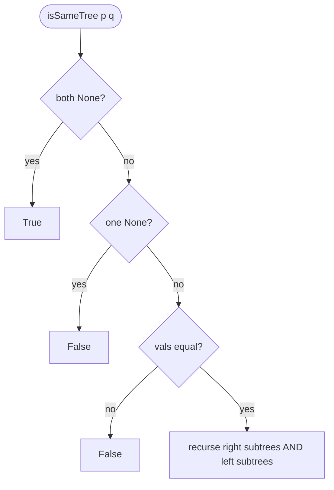
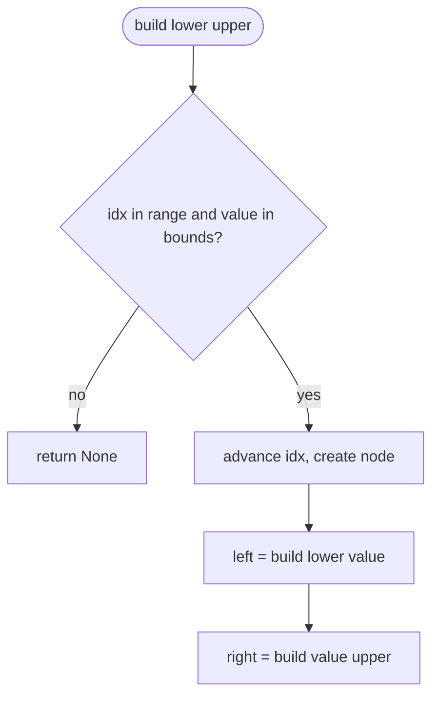
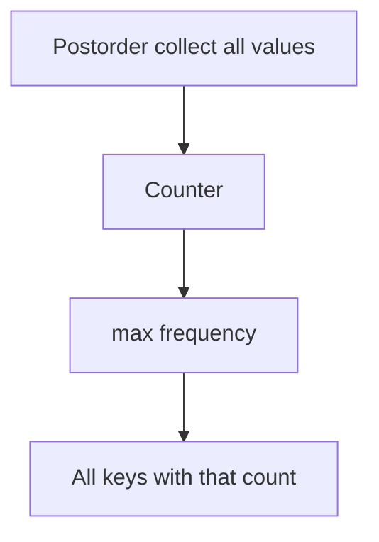
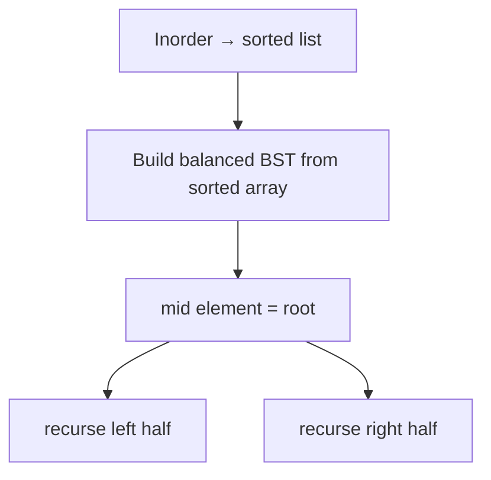
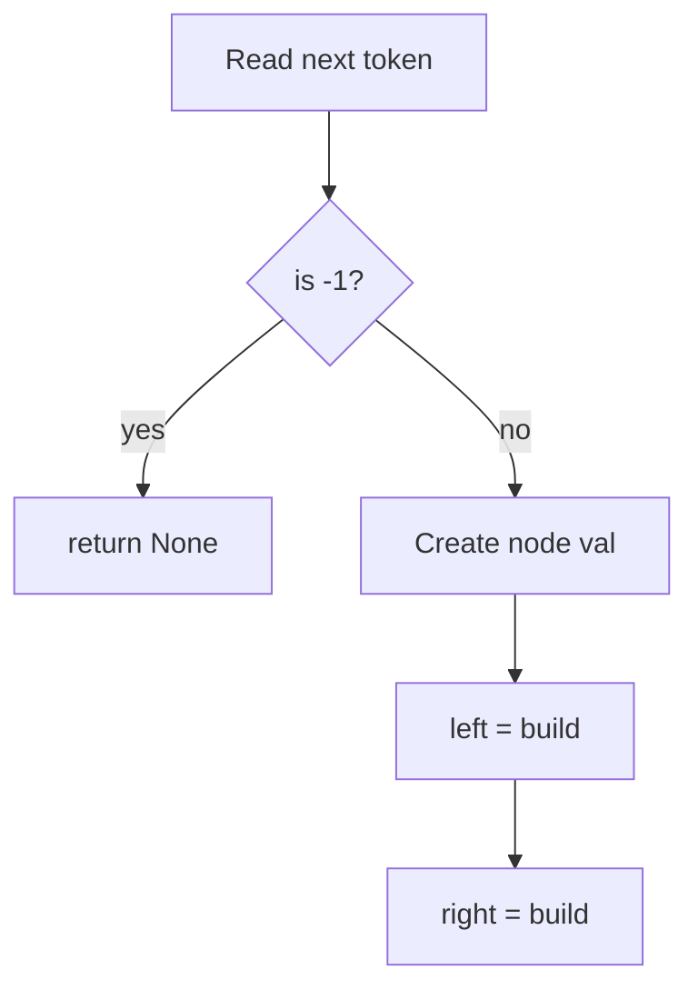

# Trees — revision flowcharts

Each section shows **code from the repo first**, then **Mermaid** (and ASCII where helpful).

**Contents:** [104 Max depth](#1-leetcode_104_max_depth_of_binary_treepy) · [94 Inorder](#2-leetcode_94_binary_tree_inorder_traversalpy) · [144 Preorder](#3-leetcode_144_binary_tree_preorder_traversalpy) · [145 Postorder](#4-leetcode_145_binary_tree_postorder_traversalpy) · [100 Same tree](#5-leetcode_100_same_treepy) · [1008 BST from preorder](#6-leetcode_1008_construct_binary_search_tree_from_preorder_traversalpy) · [501 Mode in BST](#7-leetcode_501_find_mode_in_binary_search_treepy) · [1382 Balance BST](#8-leetcode_1382_balance_a_binary_search_treepy) · [Construct from preorder -1](#9-construct_binary_tree_from_preorder_with_minus_onepy)

---

## 1. `leetcode_104_max_depth_of_binary_tree.py`

### Code

```python
class Solution(object):
    def maxDepth(self, root):
        if not root:
            return 0

        return 1 + max(self.maxDepth(root.left), self.maxDepth(root.right))
```

### Flowchart



**Facts:** O(n) time, O(h) stack.

---

## 2. `leetcode_94_binary_tree_inorder_traversal.py`

### Code

```python
class Solution(object):
    def inorderTraversal(self, root):
        self.result = []
        self.get_inorder_traversal(root)
        return self.result

    def get_inorder_traversal(self, root):
        if root is None:
            return None

        self.get_inorder_traversal(root.left)
        self.result.append(root.val)
        self.get_inorder_traversal(root.right)
```

### Flowchart



**Facts:** Left → root → right. O(n) time.

---

## 3. `leetcode_144_binary_tree_preorder_traversal.py`

### Code

```python
class Solution(object):
    def preorderTraversal(self, root):
        self.result = []
        self.get_pre_order_traversal(root)
        return self.result

    def get_pre_order_traversal(self, root):
        if root is None:
            return None

        self.result.append(root.val)
        self.get_pre_order_traversal(root.left)
        self.get_pre_order_traversal(root.right)
```

### Flowchart



**Facts:** Root → left → right.

---

## 4. `leetcode_145_binary_tree_postorder_traversal.py`

### Code

```python
class Solution(object):
    def postorderTraversal(self, root):
        self.result = []
        self._postorder(root)
        return self.result

    def _postorder(self, root):
        if root is None:
            return
        self._postorder(root.left)
        self._postorder(root.right)
        self.result.append(root.val)
```

### Flowchart



**Facts:** Left → right → root.

---

## 5. `leetcode_100_same_tree.py`

### Code

```python
class Solution(object):
    def isSameTree(self, p, q):
        if not p and not q:
            return True

        if not p or not q:
            return False

        if p.val != q.val:
            return False

        return (
            self.isSameTree(p.right, q.right)
            and
            self.isSameTree(p.left, q.left)
        )
```

### Flowchart



**Facts:** Structural + value equality; O(n) time.

---

## 6. `leetcode_1008_construct_binary_search_tree_from_preorder_traversal.py`

### Code

```python
class Solution(object):
    def bstFromPreorder(self, preorder):
        self.idx = 0

        def build(lower, upper):
            if self.idx >= len(preorder):
                return None

            value = preorder[self.idx]
            if value < lower or value > upper:
                return None

            self.idx += 1
            node = TreeNode(value)
            node.left = build(lower, value)
            node.right = build(value, upper)
            return node

        return build(float("-inf"), float("inf"))
```

### Flowchart



**Facts:** O(n) time; BST bounds from preorder.

---

## 7. `leetcode_501_find_mode_in_binary_search_tree.py`

### Code

```python
class Solution(object):
    def findMode(self, root):
        self.result = []
        self._postorder(root)
        resultant_dict = Counter(self.result)
        maximum_repetitions = max(resultant_dict.values()) if resultant_dict else 0
        return [key for key, count in resultant_dict.items() if count == maximum_repetitions]

    def _postorder(self, root):
        if root is None:
            return
        self._postorder(root.left)
        self._postorder(root.right)
        self.result.append(root.val)
```

### Flowchart



**Facts:** O(n) time and space for the list + counter.

---

## 8. `leetcode_1382_balance_a_binary_search_tree.py`

### Code

```python
class Solution(object):
    def inorder(self, root, inorder):
        if root == None:
            return
        self.inorder(root.left, inorder)
        inorder.append(root.val)
        self.inorder(root.right, inorder)

    def constructBST(self, inorder, left, right):
        if left > right:
            return None
        mid = (left + right) // 2
        root = TreeNode(inorder[mid])
        root.left = self.constructBST(inorder, left, mid - 1)
        root.right = self.constructBST(inorder, mid + 1, right)
        return root

    def balanceBST(self, root):
        inorder = []
        self.inorder(root, inorder)
        tree = self.constructBST(inorder, 0, len(inorder) - 1)
        return tree
```

### Flowchart



**Facts:** O(n) time, O(n) space for the array.

---

## 9. `construct_binary_tree_from_preorder_with_minus_one.py`

### Code (stub)

```python
class Solution(object):
    def buildTreeFromPreorder(self, preorder):
        pass
```

### Intended pattern (for revision)

Read preorder with a moving index: if next value is `-1`, return `None`; else create node, recurse left, recurse right.



**Facts:** Matches preorder with explicit null markers; implement in repo when ready.

---

## More topics

[RECURSION_FLOWCHARTS.md](../recursion_backtracking/RECURSION_FLOWCHARTS.md) · [LINKED_LIST_FLOWCHARTS.md](../linked_list/LINKED_LIST_FLOWCHARTS.md)
