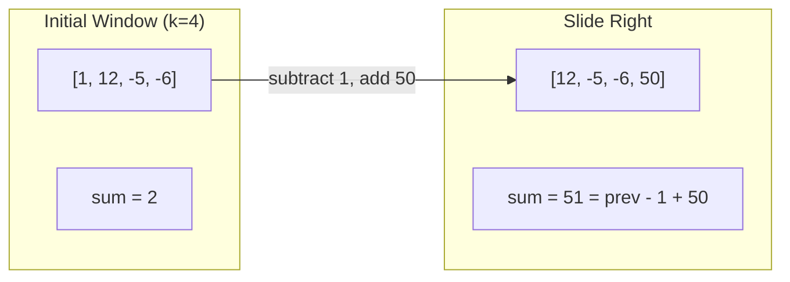
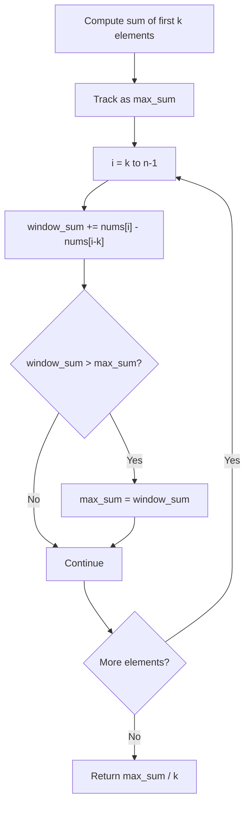
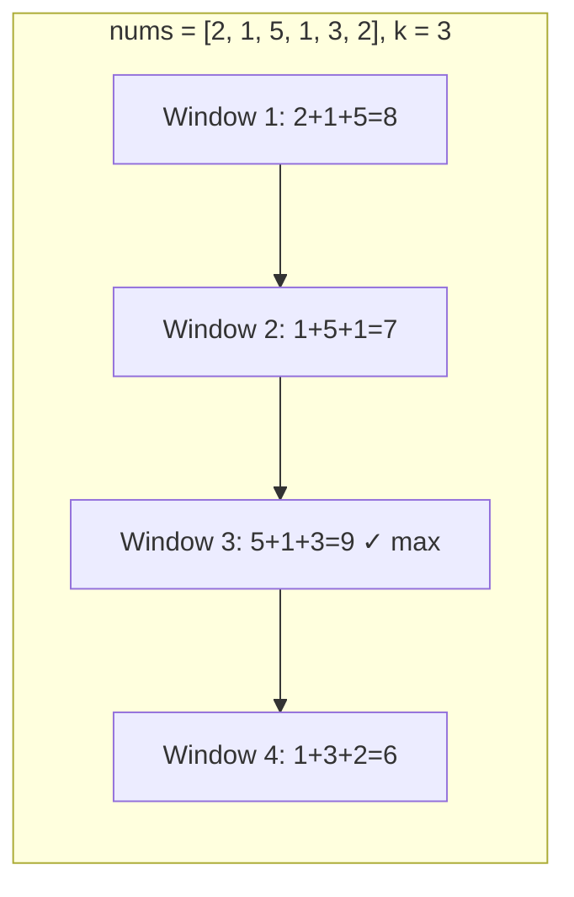
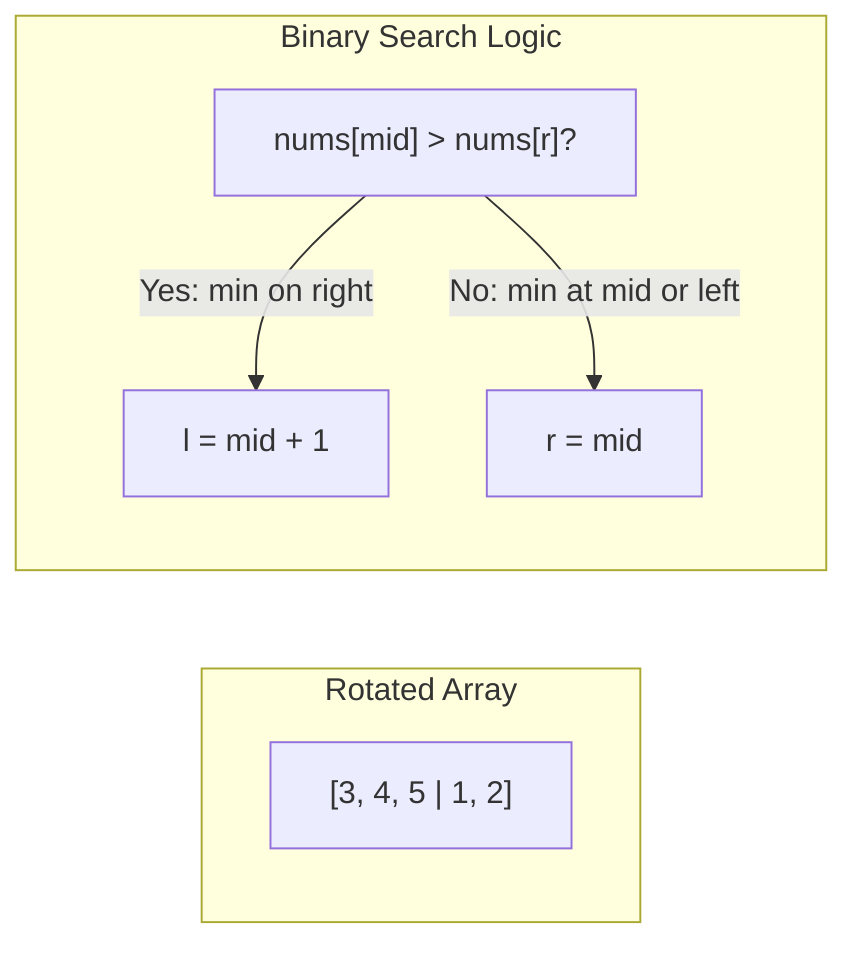
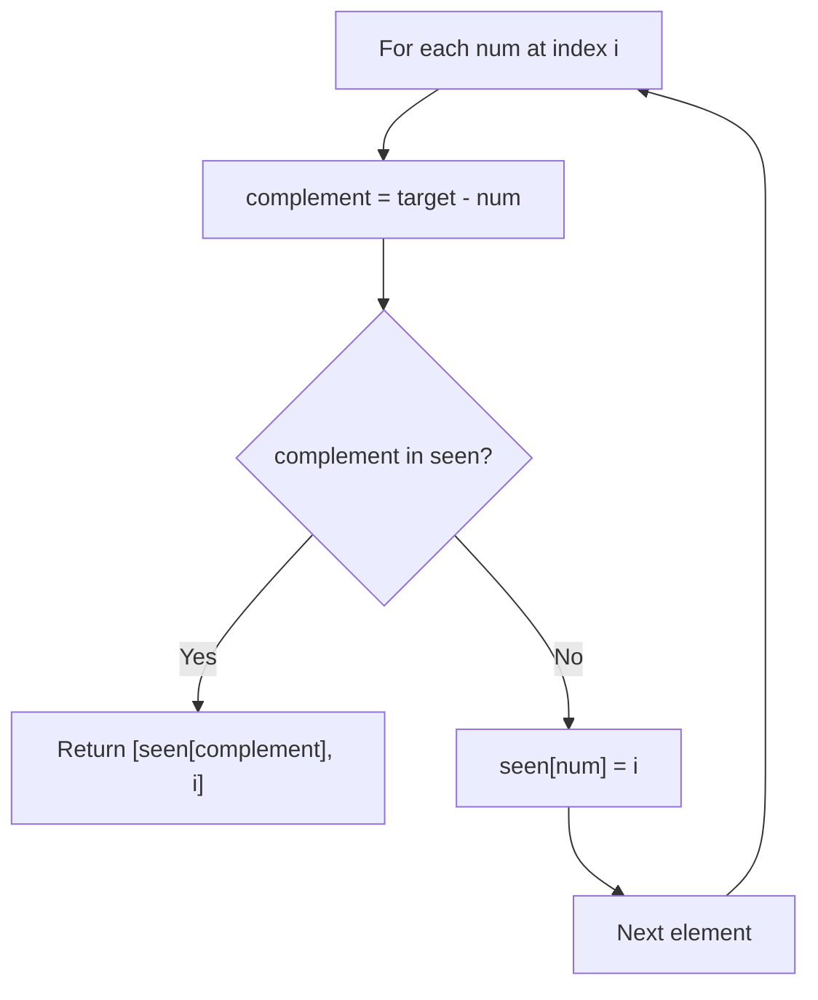
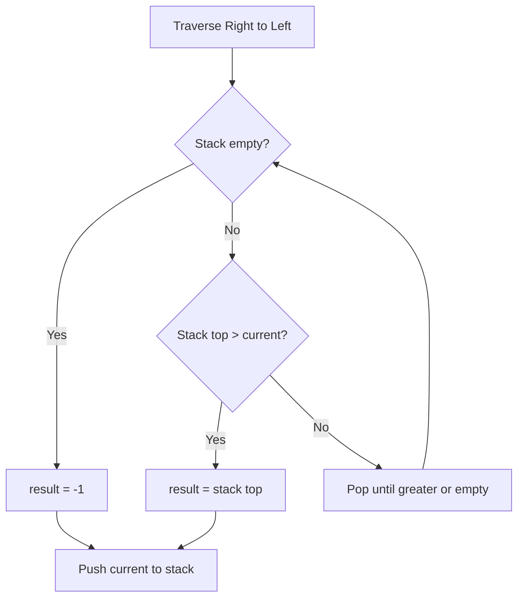
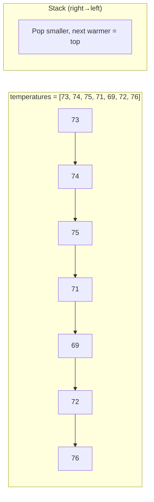
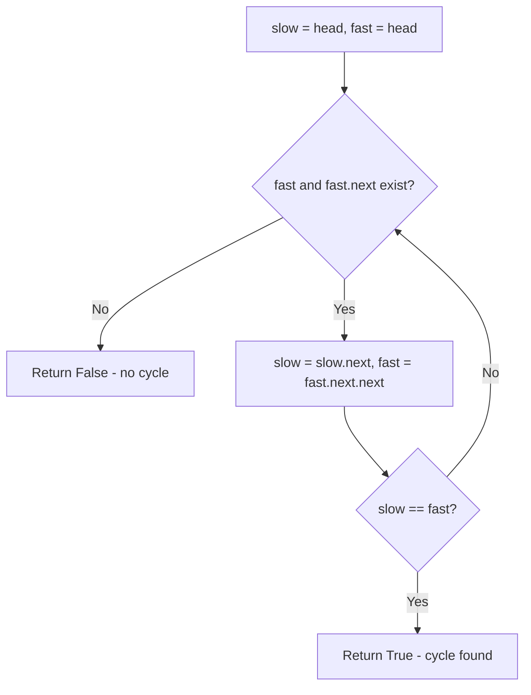
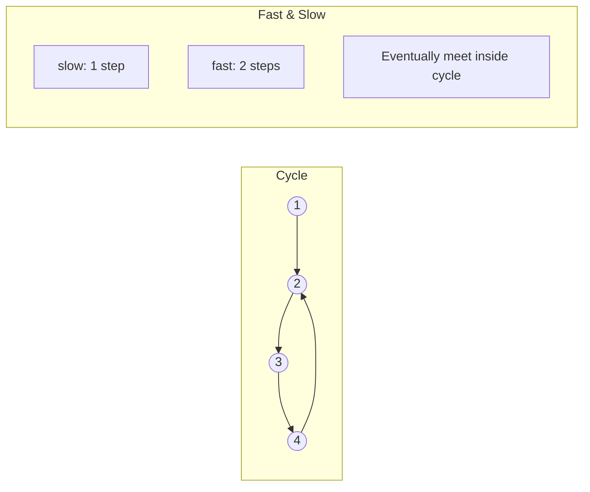
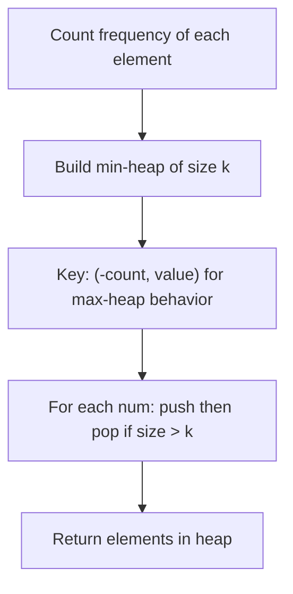

# Solution Approach Diagrams

Visual representations of how each problem was solved. These diagrams render on **GitHub** when viewing this file.

---

## Sliding Window

### 643. Maximum Average Subarray I

**Concept:** Slide a fixed-size window and track max sum (avoid recomputing entire window each time).





---

### Maximum Sum Subarray of Size K



---

## Binary Search

### 704. Binary Search (Classic)

```mermaid
flowchart TD
    A[start=0, end=n-1] --> B{start <= end?}
    B -->|No| C[Return -1]
    B -->|Yes| D[mid = start+end / 2]
    D --> E{nums[mid] == target?}
    E -->|Yes| F[Return mid]
    E -->|No| G{nums[mid] > target?}
    G -->|Yes| H[end = mid - 1]
    G -->|No| I[start = mid + 1]
    H --> B
    I --> B
```

---

### 153. Find Minimum in Rotated Sorted Array



---

## Hash Map

### 1. Two Sum (Hash Map Approach)



**Example:** `nums = [2, 7, 11, 15], target = 9`
- i=0: num=2, complement=7, not in seen → `{2: 0}`
- i=1: num=7, complement=2, **in seen** → return `[0, 1]`

---

## Stack (Monotonic)

### Next Greater Element / Daily Temperatures





---

## Two Pointers / Cycle Detection

### 141. Linked List Cycle (Floyd's Algorithm)





---

## Heap

### 347. Top K Frequent Elements



---

## Recursion / Backtracking

### 78. Subsets

```mermaid
flowchart TD
    A["dfs(idx, path)"] --> B{idx == n?}
    B -->|Yes| C[Add path to result]
    B -->|No| D[Exclude: dfs(idx+1, path)]
    D --> E[Include: dfs(idx+1, path + nums[idx])]
```

---

### 46. Permutations

```mermaid
flowchart TD
    A["backtrack(path)"] --> B{len path == n?}
    B -->|Yes| C[Add path to result]
    B -->|No| D[For each unused num]
    D --> E[Add num to path, mark used]
    E --> F[backtrack(path)]
    F --> G[Remove num, unmark]
    G --> D
```

---

## Legend

| Symbol | Meaning |
|--------|---------|
| `→` / `-->` | Flow / transition |
| `{ }` | Decision / condition |
| `[ ]` | Process / step |

---

*Diagrams use [Mermaid](https://mermaid.js.org/) syntax and render automatically on GitHub.*
